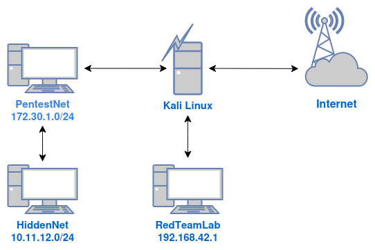
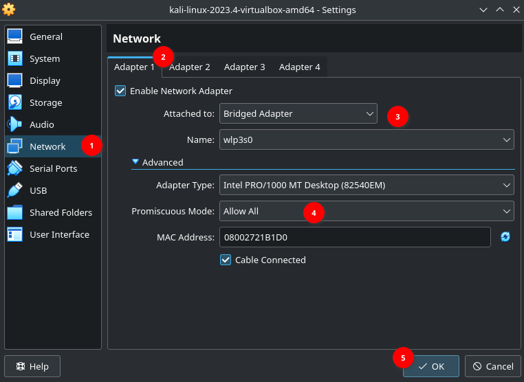
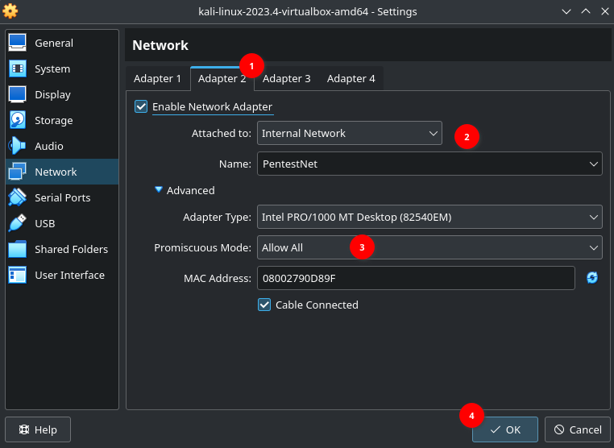
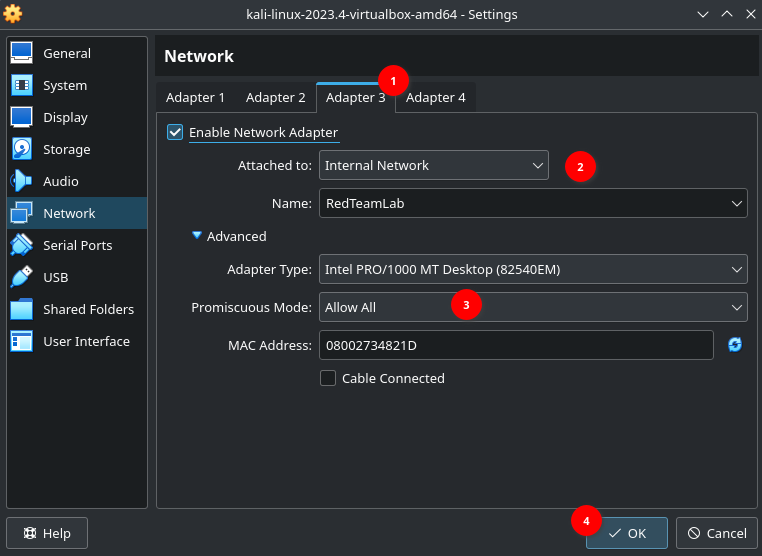
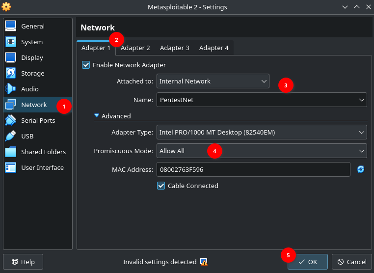
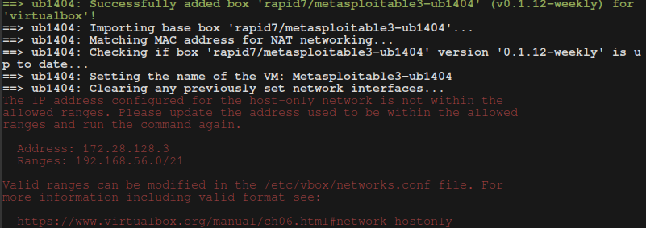
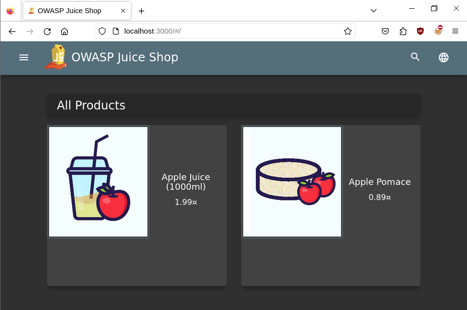

Welcome to the first part of my walkthrough for 'The Ultimate Kali Linux Book' by Glen D. Singh, this is a highly recommended book from Packt which have a reputation of provide top quality content for the IT industry. In this part I will be building multiple lab environments with vulnerable machines which I can utilise to test out different penetration techniques in a safe and legal network.
## 1. First lab within VirtualBox


The diagram demonstrate the environment for this first network lab where I will be using a popular penetration OS, Kali Linux to test out the different tools that comes within its arsenal. 

For the virtual machine of choice I went with Vbox due to previous experience with the software in the past however, upon research for different types of virtualisation I came across KVM/Qemu which is a fully open-source and a higher frequency of security update with transparent reports whereas Oracle provides security through obscurity. 

## 2. Setting up network interfaces using vboxmanage
Inside a terminal type the following commands
- Create a dhcpserver called "PentestNet" `vboxmanage dhcpserver add --network=PentestNet --server-ip=172.30.1.1 --lower-ip=172.30.1.20 --upper-ip=172.30.1.50 --netmask=255.255.255.0 --enable`
- Create a dhcpserver called "HiddenNet" `vboxmanage dhcpserver add --network=HiddenNet --server-ip=10.11.12.1 --lower-ip=10.11.12.20 --upper-ip=10.11.12.50 --netmask=255.255.255.0 --enable`
- Create a dhcpserver called "RedTeamLab" `vboxmanage dhcpserver add --network=RedTeamLab --server-ip=192.168.42.1 --lower-ip=192.168.42.20 --upper-ip=192.168.42.50 --netmask=255.255.255.0 --enable`

## 3. Setting up Kali Linux
Going through the standard VMware installation for Kali linux I will need to assign it to networks so it has LAN connection to the other machines.

In settings of Kali VM, Adapter 1:

Adapter 2:

Adapter 3:


## 4. Setting up Metasploitable 2 
Install the iso file on the internet at https://sourceforge.net/projects/metasploitable/files/Metasploitable2/ and go through standard installation on VMware:
- In VirtualBox New > Expert Mode > Name: Metasploitable2 > Memory:512M > Hard Disk > Use an Existing Virtual Hard Disk File > Hard Disk Selector > Add Metastpoitable.vmdk > Choose > Finish

In settings of Metasploitable 2 Adapter 1:


## 5. Setting up Metasploitable 3
To install Metasploitable 3 I used Vagrant, a command line utility tool to manage and download virtual machines pre-made on it's repository. The installation process is simple and can be found here https://developer.hashicorp.com/vagrant/install.

The following commands were used:
```
$ vagrant plugin install vagrant-reload
$ vagrant plugin install vagrant-vbguest
$ mkdir metasploitable3-workspace
$ cd metasploitable3-workspace
$ curl -O https://raw.githubusercontent.com/rapid7/metasploitable3/master/Vagrantfile && vagrant up
```


Encountering IP address configuration error during setup

When setting up Vagrant I encountered an error message on a misconfigured IP range, upon further research I came across someone with a similar problem and found a solution here [[1]](#references)

Issue prompt:


Fix for IP issue:
1. `sudo vim /etc/vbox/networks.conf`
2. Add an **asterisk** `*` in front of the lines
```bash
*10.0.0.0/8 172.16.0.0/12 192.168.0.0/16
*2001::/64
```
## 6. Setting up OWASP Juice Shop website
- On the Kali Linux VM terminal:
```bash
$ curl -fsSL https://download.docker.com/linux/debian/gpg | gpg - dearmor | sudo tee /usr/share/keyrings/docker-archive-keyring.gpg >/dev/null
$ echo 'deb [arch=amd64 signed-by=/usr/share/keyrings/docker-archive-keyring.gpg] https://download.docker.com/linux/debian buster stable' | sudo tee /etc/apt/sources.list.d/docker.list
```
```bash
$ sudo apt install -y docker-ce docker-ce-cli containerd.io
$ sudo docker pull bkimminich/juice-shop
$ sudo docker pull bkimminich/juice-shop
```
- Connect to OWASP website `http://localhost:3000`


## 7. Setting up OWASP Broken Web Applications
Install the zip file on the internet at https://sourceforge.net/projects/owaspbwa/files/ 

This will contain pre-made Vbox machines which needs to be connected to the lab network:

- VM Box > New > Expert Mode > Name: OWASP BWA > Type: Linux > Memory: 1024 MB > Hard Disk Selector add: OWASP Broken Web Apps-cl1.vmdk > Choose > Finish
- Click on Settings of OWASP Web > Network > Adapter 1 > Attached to: Internal Network > Name: PentestNet > OK 
- Login : root:owaspbwa

This was it for this walkthrough on how to install and setuping up multiple virtual machines and having them connected to a private network for testing, there is an extended section to setup an environment for **advanced hacking techniques** but will be covered in a later part. Next I will be covering passive information-gather, one of the most important step to a great attack. 

## References
1. https://stackoverflow.com/questions/70704093/the-ip-address-configured-for-the-host-only-network-is-not-within-the-allowed-ra 
