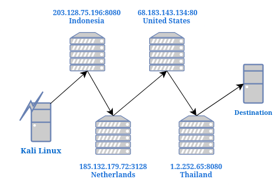

Welcome to the second part of my walkthrough of 'The Ultimate Kali Linux Book' by Glen D. Singh, for this section I will be covering different passive open source intelligence techniques (OISNT) which are ways to collecting information on a target available openly on the internet.

Information doesn't need to be secret to be valuable, which is why we should be cautious of what information we put out on the internet. I will be demonstrating common tools used for OSINT, ways to mask investigations from target and how data collected can be used in a attack.

## 1. Anonymising Traffic during Investigations
When penetesting an organisation it's important to mask my identity as #1 it will test out the intrusion detection systems in placed and #2 it's good practice to use OPSEC.

### 1.2 Using Proxy chaining to mask traffic

A proxy is basicly a computer which you past down requests to a destination for you. A proxy chain is basicly like a relay race where you past the batton (requests) to the next person and they do the same to the last chain.

**Harder to track:** Proxy chains are used as they make it harder for a request to be traced back to its original source as logs have to be requested from proxy which can be time consuming and lot of work.


Found out more on proxies here: [[All-on Proxies]](../../all-in-one/all-on-proxies/)
