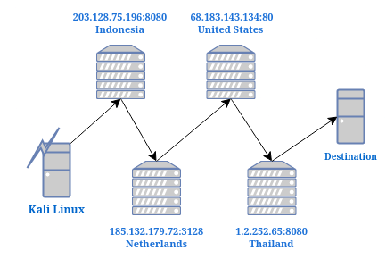
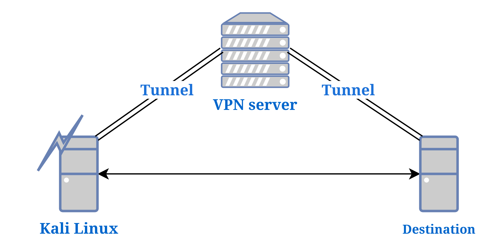
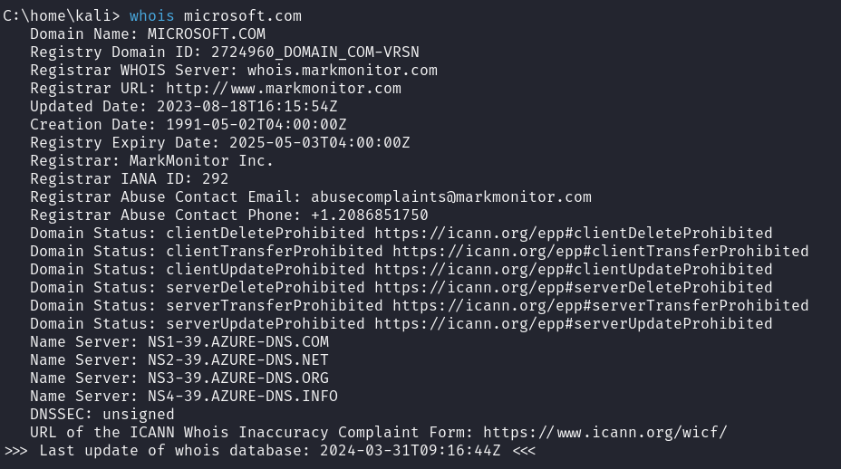
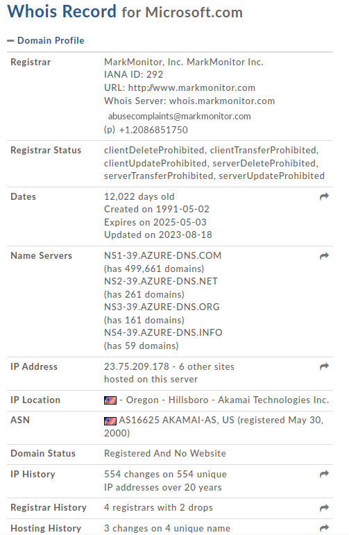
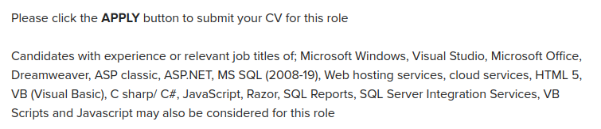
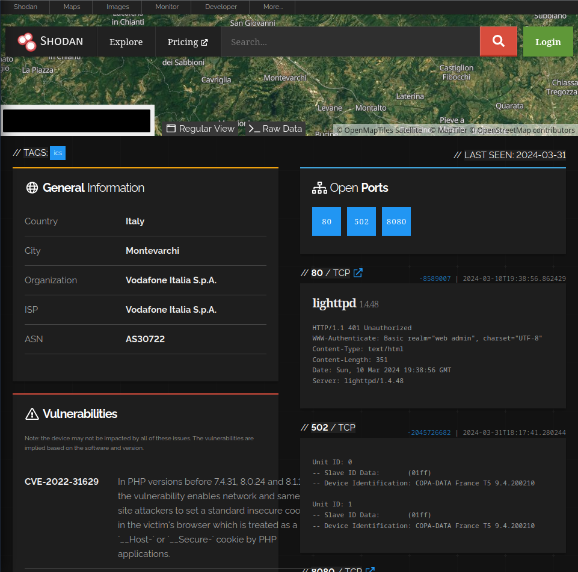
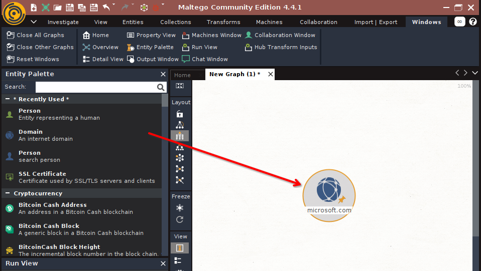
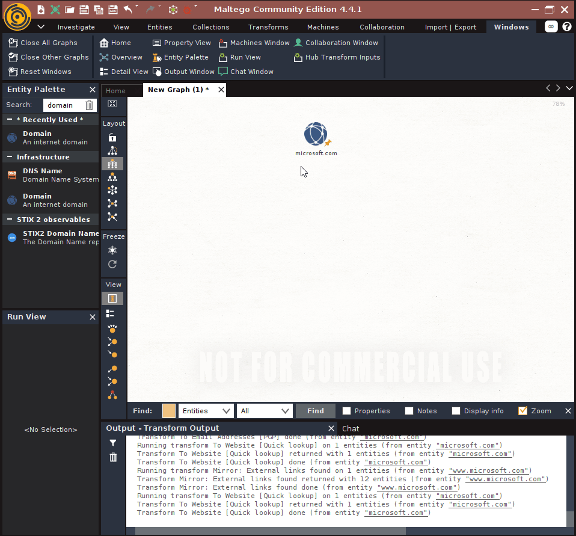
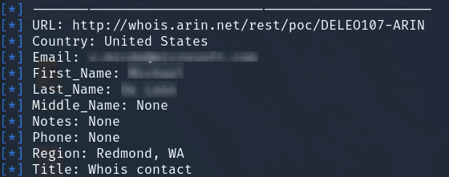

Techniques to avoid traces back to identity, browsing the web to collect information on a target and social media account leaks.

Welcome to the second part of my walkthrough of 'The Ultimate Kali Linux Book' by Glen D. Singh, for this section I will be covering different passive open source intelligence techniques (OISNT) which are ways to collecting information on a target available openly on the internet.

Information doesn't need to be secret to be valuable, which is why we should be cautious of what information we put out on the internet. I will be demonstrating common tools used for OSINT, ways to mask investigations from target and how data collected can be used in a attack.

## 1. Anonymising Traffic during Investigations
When penetesting an organisation it's important to mask my identity as #1 it will test out the intrusion detection systems in placed and #2 it's good practice to use OPSEC.

### 1.2 Using Proxy chaining to mask traffic

A proxy is basicly a computer which you past down requests to a destination for you. A proxy chain is basicly like a relay race where you past the batton (requests) to the next person and they do the same to the last chain.

**Harder to track:** Proxy chains are used as they make it harder for a request to be traced back to its original source as logs have to be requested from proxy which can be time consuming and lot of work.


Find out more on proxies here: [[All-on Proxies]](../../all-in-one/all-on-proxies/)


### 1.3 Using Virtual Private Networks (VPN) to mask traffic



A VPN is similar to a proxy where you relay your traffic to another computer so the request comes from them and shows their ip instead of yours. 

Using a VPN is great for changing your location but I would say their not a worthy technique to mask traffic as their are lots of issues which arise with VPNs. [[1]](https://restoreprivacy.com/vpn/warning-list/)


Find out more about VPNs here: [[All-on VPNs]](../../all-in-one/all-on-vpn/)


## 2. Gathering an Organisation's IT Infrastructure
When pentesting an organisation, 80% of the process will be gathering information through the internet and scanners, the other 20% will be exploiting findings and writing detailed reports.

There are plenty of tools out there that will scrape the internet for information on a target which I think some are more helpful than others but it doesn't hurt to check most of them as one piece of information can make all the difference during recon.

### 2.1 Using Whois {#whois}
Whois is a tool which allows you to pull information from a public database of who is behind a certain domain name. When registering a website some services will provide the option to hide information hosted to the databse for a fee.

This includes:
- Registrants
- Administrative contact information 
- Dates on registration, update and expiration 
- Registry domain ID
- Name servers

#### 2.1.1 Linux Whois tool
```
$ whois <domain>
```


#### 2.1.2 Website Whois alternative
There are also whois domain lookup tools online which will organise information pulled in a more readable format such as: https://whois.domaintools.com 



### 2.2 Using Job Listings
Another great way to get information of an organisation's infrastructure is by looking at job postings for IT positions as these will list technologies they may use.



Here is what I've found from a job listing for a system developer programmer post, these can all be researched for vulnerabilities especially the MS SQL server (2008-19) as this shows they may use older software. [[2]](https://www.cvedetails.com/vulnerability-list/vendor_id-26/product_id-251/version_id-537052/Microsoft-Sql-Server-2008.html?page=1&order=1&trc=5&sha=8e264eacb5dd38ff3230beab590e25a3288243ea)
### 2.3 Shodan.io
Shodan is an online provider which allows professionals lookup the domain of a website to provide with:
- Open ports
- Known vulnerability CVE codes
- Technologies used hosted on ports


This can be useful for discovering possible entry points on a target but I think this isn't worth the **$69/month** price tag as most results are from large organisations and isn't helpful for smaller targets.
### 2.4 Maltego
Maltego is a reconnasaince tool which provides a unique way to display scans done through the use of graphs to help you visualise the layout of a target. This can automate the process of scanning for publicly accessible servers, IP addresses, employee's email addresses, subdomains of web pages and more.

- You can start by creating a new graph > entity menu > infrastructure > click and drag domains onto graph

Here is a demonstration of Maltgeo scanning Microsoft.com for similar domains and emails it can scrape from the internet.

## 3. Gathering Employees' information
Now it is ever more common to find and gather employee credentials and the culture of an organisation as more and more people use social media as their daily routine which entices them to share things that organisations wouldn't want to be exposed online such as:
- Pictures of employee badge
- Technologies used in background such as on screens, cameras, SCADA systems
- Uniforms and work culture

### 3.1 Instagram / Facebook / Linkedin
Using Instagram, Facebook and Linkedin can be helpful as most organisations will have an online precense which is worth check for any valuable information, these can be usually found in posts made, tagged posts or events.
 

### 3.2 Recon-ng 
The Recon-ng framework is designed to bring all common OSINT tools under one roof for convinience by providing menus for navigation and management of information found.This tool comes pre-installed with Kali and the documents can be found here: https://github.com/lanmaster53/recon-ng


In the demo above I have loaded the 'whois_procs' module which will search for names and emails related to a domain. After configuration the `run` command is used which will execute the scrapping and produce a list of results:

### 3.3 theHarvester
The Harvester is another tool which is similar to Recon-ng where it serves as a central tool to scrap information such as emails, names, phone number and more from difference sources. It comes pre-install with Kali and its documents can be found here: https://github.com/laramies/theHarvester
```bash
# Open help menu 
$ theHarvester -h         
#Perform a scan with specific module 
$ theHarvester -d microsoft.com --dns-server 8.8.8.8 [module]
```
### 3.4 Sherlock 
The Sherlock project is a open-source tool which will search over 200 possible social media platforms for a given username. This is especially helpful to scan for a persons online precences once their username is found (e.g. Instagram username can be used)

#### Installation
```bash
$ git clone https://github.com/sherlock-project/sherlock.git
$ cd sherlock/
$ sudo pip install -r requirements.txt 
```
Search accounts with:
```bash
$ python3 sherlock <username>
$ python3 sherlock <username> --timeout 5        # 5 sec search
```



May result with unrelated accounts to target

Sherlock is a great tool however, it may result with accounts that aren't related to the target if their username is common or too broad but it is still worth looking through the list

This concludes everything for my walkthrough or the reconnaissance and footprinting section of ‘The Ultimate Kali Linux Book’ by Glen D. Singh. In the next section I will be covering active reconnaissance techniques such as **nmap**, Google dorks, **metasploit** and more.
## References
1. https://restoreprivacy.com/vpn/warning-list/
2. [https://www.cvedetails.com/vulnerability-list/vendor_id-26/product_id-251](https://www.cvedetails.com/vulnerability-list/vendor_id-26/product_id-251/version_id-537052/Microsoft-Sql-Server-2008.html?page=1&order=1&trc=5&sha=8e264eacb5dd38ff3230beab590e25a3288243ea)
3. https://github.com/lanmaster53/recon-ng
4. https://github.com/laramies/theHarvester

