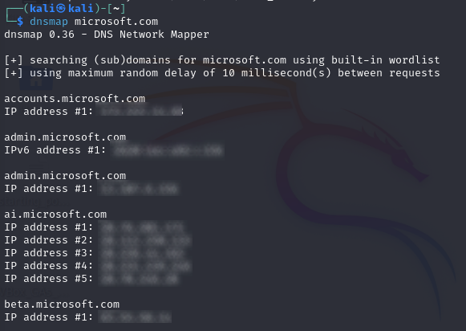

Scratching the surface of the vast world of active recon, exploring tools which provide juicy information such as nmap, metasploit, netdiscover and more.

Welcome to the third part of the my walkthrough of ‘The Ultimate Kali Linux Book’ by Glen D. Singh, in this section I'll be going over some active information techniques. These directly interacts with the target which is helpful at collecting juicy information such as ports which can be later on exploited for vulnerabilities and all the exciting stuff.

## 1. DNS reconnaissance and zone transfers
When wanting to explore a certain website you will be likely familiar with entering it's name known as a domain (e.g. YouTube.com) which will redirect you to its landing page. 

Under the hood of the internet we have what's called a domain name server which sole purpose is to take the URL you've typed and convert it into an IP address which a browser can understand to connect to the correct computer over the world wide web. Similar to a phone book where you'd look up the name of a person and find their dial number.

### 1.2 Different types of DNS records
A DNS lookup tool will provide different types of records which can give valuable information to create a strong profile on a target.

The following are the different record types:
- **A**: Resolves a hostname to an IPv4 address.
- **AAAA**: Resolves a hostname to an IPv6 address.
- **NS**: Contains the name servers' information.
- **MX**: Contains the mail exchange (email) servers.
- **PTR**: Resolves an IP address to a hostname.
- **CNAME**: Provides a canonical name or an alias.
- **RP**: Specifies the person that's responsible for the domain.
- **SOA**: Contains information about the administrator of the domain.
- **SRV**: Contains a service port number for a specific service of the domain

Performing DNS enumeration techniques can provides information such as IP ranges, subdomains, email servers.

### 1.3 Scanning for subdomains and name servers

```
# Display name servers (ns) using host
$ host -t ns zonetransfer.me
```


```
# Display subdomains using dnsmap
dnsmap microsoft.com
```



## 2. Zone transfers vulnerabilities
Sometimes when setting up a website either by hosting it yourself or going with a service provider there may be some misconfigurations such as allowing zone transfers.

Its purpose is to allow domain server to easily transfer old records of a known URL to create redundancy incase the primary server is down. Upon request if misconfigured, the DNS will send all records it currently has on a URL which can be used to exploits other part of a target.

### 2.1 Performing a zone transfer attack
My target will be [zonetransfer.me](https://digi.ninja/projects/zonetransferme.php) which has been configure to accept all zone transfer requests for demonstration purposes.

1. Retrieve a name server using the [[Whois tool]](../part-2-reconnaissance-and-footprint/#whois) 

2. Using the `dig` command on kali: `dig axfr @nsztm2.digi.ninja zonetransfer.me`

```
; <<>> DiG 9.19.21-1-Debian <<>> axfr @nsztm2.digi.ninja zonetransfer.me
; (1 server found)
;; global options: +cmd
zonetransfer.me.        7200    IN      SOA     nsztm1.digi.ninja. robin.digi.ninja. 2019100801 172800 900 1209600 3600
zonetransfer.me.        300     IN      HINFO   "Casio fx-700G" "Windows XP"
zonetransfer.me.        301     IN      TXT     "google-site-verification=tyP28J7JAUHA9fw2sHXMgcCC0I6XBmmoVi04VlMewxA"
zonetransfer.me.        7200    IN      MX      0 ASPMX.L.GOOGLE.COM.
zonetransfer.me.        7200    IN      MX      10 ALT1.ASPMX.L.GOOGLE.COM.
zonetransfer.me.        7200    IN      MX      10 ALT2.ASPMX.L.GOOGLE.COM.
zonetransfer.me.        7200    IN      MX      20 ASPMX2.GOOGLEMAIL.COM.
zonetransfer.me.        7200    IN      MX      20 ASPMX3.GOOGLEMAIL.COM.
zonetransfer.me.        7200    IN      MX      20 ASPMX4.GOOGLEMAIL.COM.
zonetransfer.me.        7200    IN      MX      20 ASPMX5.GOOGLEMAIL.COM.
zonetransfer.me.        7200    IN      A       5.196.105.14
zonetransfer.me.        7200    IN      NS      nsztm1.digi.ninja.
zonetransfer.me.        7200    IN      NS      nsztm2.digi.ninja.
_acme-challenge.zonetransfer.me. 301 IN TXT     "2acOp15rSxBpyF6L7TqnAoW8aI0vqMU5kpXQW7q4egc"
_acme-challenge.zonetransfer.me. 301 IN TXT     "6Oa05hbUJ9xSsvYy7pApQvwCUSSGgxvrbdizjePEsZI"
_sip._tcp.zonetransfer.me. 14000 IN     SRV     0 0 5060 www.zonetransfer.me.
14.105.196.5.IN-ADDR.ARPA.zonetransfer.me. 7200 IN PTR www.zonetransfer.me.
asfdbauthdns.zonetransfer.me. 7900 IN   AFSDB   1 asfdbbox.zonetransfer.me.
asfdbbox.zonetransfer.me. 7200  IN      A       127.0.0.1
asfdbvolume.zonetransfer.me. 7800 IN    AFSDB   1 asfdbbox.zonetransfer.me.
canberra-office.zonetransfer.me. 7200 IN A      202.14.81.230
cmdexec.zonetransfer.me. 300    IN      TXT     "; ls"
contact.zonetransfer.me. 2592000 IN     TXT     "Remember to call or email Pippa on +44 123 4567890 or pippa@zonetransfer.me when making DNS changes"
dc-office.zonetransfer.me. 7200 IN      A       143.228.181.132
deadbeef.zonetransfer.me. 7201  IN      AAAA    dead:beaf::
dr.zonetransfer.me.     300     IN      LOC     53 20 56.558 N 1 38 33.526 W 0.00m 1m 10000m 10m
DZC.zonetransfer.me.    7200    IN      TXT     "AbCdEfG"
email.zonetransfer.me.  2222    IN      NAPTR   1 1 "P" "E2U+email" "" email.zonetransfer.me.zonetransfer.me.
email.zonetransfer.me.  7200    IN      A       74.125.206.26
Hello.zonetransfer.me.  7200    IN      TXT     "Hi to Josh and all his class"
home.zonetransfer.me.   7200    IN      A       127.0.0.1
Info.zonetransfer.me.   7200    IN      TXT     "ZoneTransfer.me service provided by Robin Wood - robin@digi.ninja. See http://digi.ninja/projects/zonetransferme.php for more information."
internal.zonetransfer.me. 300   IN      NS      intns1.zonetransfer.me.
internal.zonetransfer.me. 300   IN      NS      intns2.zonetransfer.me.
intns1.zonetransfer.me. 300     IN      A       81.4.108.41
intns2.zonetransfer.me. 300     IN      A       52.91.28.78
office.zonetransfer.me. 7200    IN      A       4.23.39.254
ipv6actnow.org.zonetransfer.me. 7200 IN AAAA    2001:67c:2e8:11::c100:1332
owa.zonetransfer.me.    7200    IN      A       207.46.197.32
robinwood.zonetransfer.me. 302  IN      TXT     "Robin Wood"
rp.zonetransfer.me.     321     IN      RP      robin.zonetransfer.me. robinwood.zonetransfer.me.
sip.zonetransfer.me.    3333    IN      NAPTR   2 3 "P" "E2U+sip" "!^.*$!sip:customer-service@zonetransfer.
sqli.zonetransfer.me.   300     IN      TXT     "' or 1=1 --"
sshock.zonetransfer.me. 7200    IN      TXT     "() { :]}; echo ShellShocked"
staging.zonetransfer.me. 7200   IN      CNAME   www.sydneyoperahouse.com.
alltcpportsopen.firewall.test.zonetransfer.me. 301 IN A 127.0.0.1
testing.zonetransfer.me. 301    IN      CNAME   www.zonetransfer.me.
vpn.zonetransfer.me.    4000    IN      A       174.36.59.154
www.zonetransfer.me.    7200    IN      A       5.196.105.14
xss.zonetransfer.me.    300     IN      TXT     "'><script>alert('Boo')</script>"
zonetransfer.me.        7200    IN      SOA     nsztm1.digi.ninja. robin.digi.ninja. 2019100801 172800 900  3600
;; Query time: 100 msec
;; SERVER: 34.225.33.2#53(nsztm2.digi.ninja) (TCP)
;; WHEN: Wed Apr 10 07:15:39 BST 2024
;; XFR size: 51 records (messages 1, bytes 2141)

```
Going through these records from the zone transfer we can see contact details for "Robin Wood" robin@digi.ninja 

## 3. Discovering live systems on a network

Relying on just DNS scanning isn't sufficient and I will need better tools to gain more useful information.

### 3.1 Using netdiscover 
A helpful built-in tool which comes with kali as a way to scan available devices on a connected network with passive mode available which doesn't probe packets to devices.

```bash
sudo netdiscover -pf # Random, passive and fast scan
sudo netdiscover -r 172.30.1.0/24 # Range scan 
```
- `-p` Passive option will listen to packets that are being sent
- `-f` Fast mode, saves time for auto scans 


### 3.2 Using nmap to discover devices and ports
Nmap is most known for it's port scanning abilities, but it also have additional features such as scripts exploit for enumeration and device discovery.

Find out more about Nmap's host discovery feature: [Nmap Manual - host discovery](https://nmap.org/book/man-host-discovery.html)


```bash
nmap -sn 172.30.1.0/24 --exclude 172.30.1.1 # Device range scan, exlcude given ip
nmap <IP>                   # Will scan for ports up to 1000
nmap -A -T4 -p- <IP>        # Version scan, Timing, port scan all or specific -p<port range>
nmap -O <IP>                # Displays the operating system of target
nmap <IP> -D<IP1>,<IP2>,..  # Add decoys to scan, ensure decoys are online
nmap -sV <IP>               # Give version of port technology used
```


### 3.3 Using Metasploit to discover ports
A framework designed to provide a suite of scripts for recon, exploits, payload generation and post-exploitation features which all fall within their own categories:
- **Auxiliary** are reconnaissance methods to gather data on a target 
- **Exploits** will use vulnerabilities found and leverage them on the targeted host 
- **Payloads** are used to execute commands on a remote host
- **Posts** used after a machine has been compromised

The recon scripts can be found within the auxiliary category when searching for technologies to scan.
```bash
# Scan for auxiliary tools, add more keywords for specific tech 
msf6> search auxiliary <keyword>
# Load module
msf6> use auxiliary/scanner/portscan/syn
```

#### 3.3.1 Using Metasploit to enumerate SSH ports
An example of using the auxiliary scanners would be to scan for ssh versions which has been open on our target machine. 

Use this tool within the Metasploit framework `msf6> use auxiliary/scanner/ssh/ssh-version`

set the target with `msf6 (ssh_version)> set RHOSTS <IP>` and `run`


This concludes everything for my walkthrough for chapter 3 of ‘The Ultimate Kali Linux Book’ by Glen D. Singh. 

Feel like I am picking up on speed slowly as I am working towards my note taking skills so posting blogs will take less time and will ideally be what I take notes on, anyways next section will be on scanning for vulnerabilities which is the next step after the recon phase. Hope to see you there.
## References
1. https://digi.ninja/projects/zonetransferme.php - Zone transfer demo
2. https://nmap.org/book/man-host-discovery.html - Nmap host discovery documents