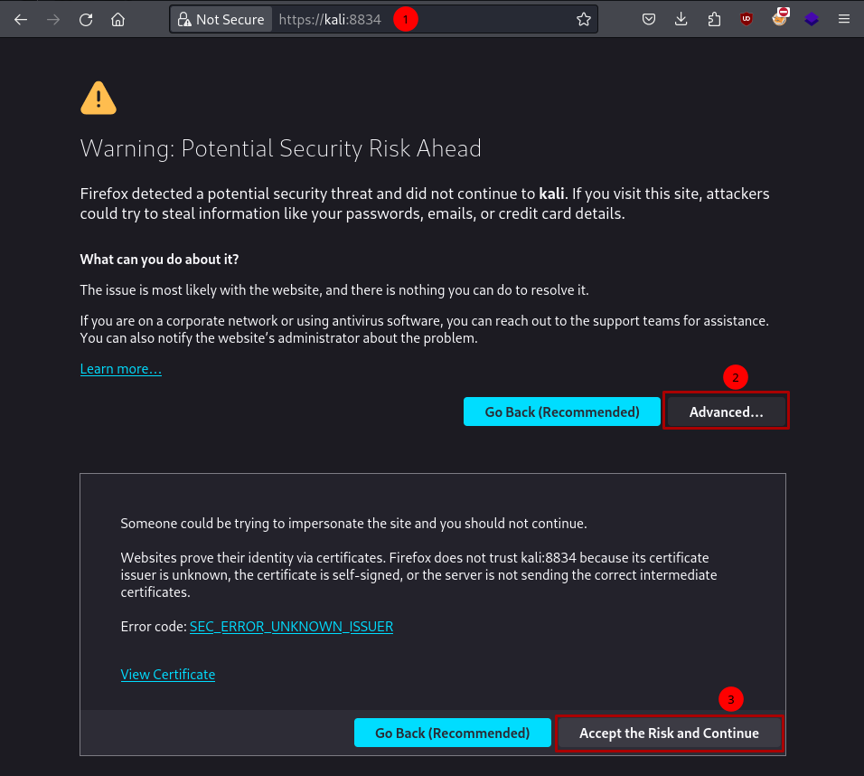
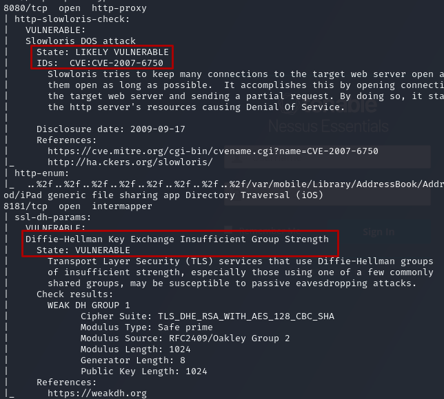
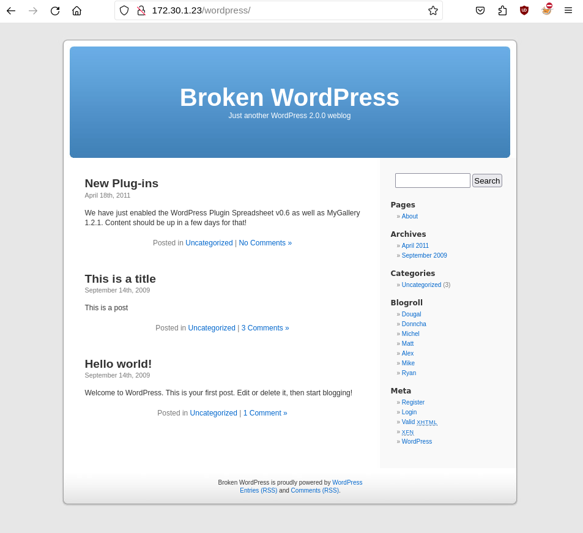
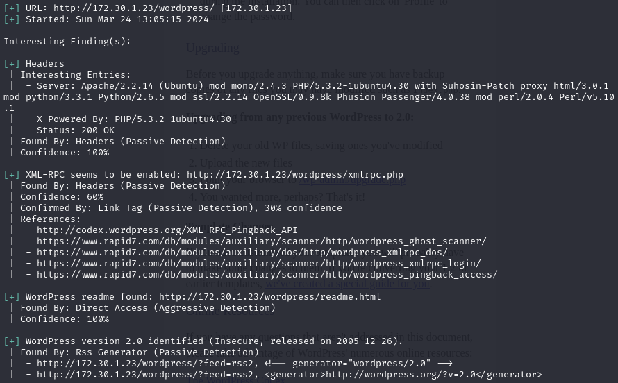
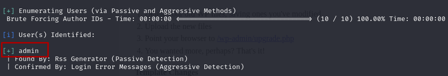

Ever wondered what would be an effective way to find vulnerabilities within your organisational systems with ease﹖ Well in this section I will be covering vulnerability scanners for overall systems and websites which provide amazing reports within minutes!

Welcome to the fourth part of the my walkthrough of ‘The Ultimate Kali Linux Book’ by Glen D. Singh. Ever wondered what kind of tools professional penetration testers use to discover vulnerabilities? What to do once you have scanned for technology version? Where to find critical security issues in systems? Well all that will be answered in this section.

## 1. Nessus 
Nessus is a service which utilises all sort of scanning techniques and provides a central hub accessed through your browser which makes it easy to manage scans.

### 1.2 How to Install Nessus on Kali

1. First install the deb file on Kali linux provided on Tenable Nessus official download page: https://www.tenable.com/downloads/nessus?loginAttempted=true

This should be for platform `Linux-Debian-amd64 Debian 10, 11, 12 / Kali Linux`

2. Change directory where file is download and execute the following commands:
``` bash
$ sudo dpkg -i Nessus-8.15.0-debian6_amd64.deb
$ sudo systemctl start nessusd
```

3. Go to https://kali:8834 in your browser and accept warning to enter the login portal of nessus 



4. Register for a activation code at https://www.tenable.com/products/nessus/nessus-essentials and go through the Nessus Essential installation process within the browser setup.


If login page is shown instead of activation wizard setup within the web portal, use this guide to register offline: 

https://community.tenable.com/s/article/How-to-reset-register-your-Nessus-license-for-offline-installations?language=en_US

### 1.3 Basic Scans With Nessus
1. When the setup is completed you will be prompted with the option to provide the program with a list of targets to scan which I've entered the [[Win2k8 IP address from chapter 1]](../part-1-buidling-a-penetration-testing-labs/#5-setting-up-metasploitable-3):


This will start an automatic Basic scan which will reveal surface-level vulnerabilities which can be seen in the 'My Scans' section in the navigation menu.

2. When navigating to 'New scan' Nessus will provide different types of scans to choose from ranging from full-fledged scans to specific vulnerability scans:

Main types of scans: 
- Host Discovery 
- Basic Network Scan 
- Advanced Scan
- Malware Scan

3. The basic scan option is great to generate a quick report on surface-level vulnerabilities:


I can see the different results from the basic scan which are separated into different types folders which upon clicking will reveal findings of vulnerabilities, version types and information on technology used by the target:

4. Here I am looking at the Apache Tomcat folder which will provide further information as to what can be exploited along with the CVE code:


5. A scan will provide vulnerabilities along with it Common vulnerability Score System (CVSS) out of 10 to show danger levels which can be determined by this calculator https://www.first.org/cvss/calculator/4.0#CVSS:4.0/AV:N/AC:L/AT:N/PR:N/UI:N/VC:N/VI:N/VA:N/SC:N/SI:N/SA:N

## 2. Making Use Of Nmap's Scripting Engine NSE

For more information check out the documentation at: https://nmap.org/book/nse.html

Nmap scripting engine is a repository of scripts which are separated into different categories which can be used along with scans to enrich the reconnaissance phase.

The defined categories are as followed:
`auth`, `broadcast`, `brute`, `default`. `discovery`, `dos`, `exploit`, `external`, `fuzzer`, `intrusive`, `malware`, `safe`, `version`, and `vuln` 


See available scripts at: https://nmap.org/nsedoc/scripts/


```bash
nmap --script-help "afp-* and discovery"
nmap --script=<keyword>
nmap --script=ftp-vsftpd-backdoor 172.30.1.20
nmap --script=vuln 172.30.1.20
```


## 3. Greenbone Vulnerability Mananger GVM

Greenbone Community Edition has come to its end-of-life in Jan 2023 and will be fully off Docker hub by June 2024 :(
See link for more details: [GVM Community Edition 21.04 End of Life](https://forum.greenbone.net/t/greenbone-community-edition-21-04-end-of-life/13837)
 

This tool seems to be similar to nessus tool which provides lots of options for reconnaissance.

```bash
sudo apt install gvm
sudo gvm-setup
sudo gvm-start
sudo runuser -u _gvm -- gvmd --user=admin --new-password=new_password  # reset pass
```

1. When performing the setup commands for GVM you will be provided with a admin password, make a note of this as this is important as it is needed for the sign in page in your browser:


2. Upon login in you will see the main dashboard with charts, select Configuration > Targets > New Target:


3. After setting a target create a task in Scans > Tasks to perform a basic automated scan on the target you've set earlier


🚧 Incomplete section, need to make time to properly try GVM due to Community version loosing official support.
Full installation guide here: https://forum.greenbone.net/t/greenbone-community-edition-22-4-stable-initial-release-2022-07-25/12638 🚧

## 4. Using Web Application Scanners
Scanning a machine for all possible vulnerabilities on the surface level is good but what if your target is a website? Well here I will be covering just the surface of different web application scanners which may reveal information that can be of use as a pentester.

### 4.1 WhatWeb
Whatweb is a recon tool used to retrieve different aspect of websites such as web servers, OS, content management system and other technologies by sending HTTP request and analysing the response.

Here is an example of it being used with `whatweb <IP>`:


Whoah, that's a lot of information received from just a basic scan! 

This tool provides custom depth searches and HTTP header customisation which I will be playing with more in the future so stay tuned.

### 4.2 Using NSE Web Application Scanning Scripts
If you remember from earlier we looked at Nmap's scripting engine which provided a huge library of ready-to-use battle scripts for both recon and exploitation.

To look at the scripts available for web application you can use pattern search to list what's out there with 

```bash
$ ls /usr/share/nmap/scripts/http*
```

Here are some of the results for http result alone! 
```bash
/usr/share/nmap/scripts/http-open-redirect.nse
/usr/share/nmap/scripts/http-passwd.nse
/usr/share/nmap/scripts/http-phpmyadmin-dir-traversal.nse
/usr/share/nmap/scripts/http-phpself-xss.nse
/usr/share/nmap/scripts/http-php-version.nse
/usr/share/nmap/scripts/http-proxy-brute.nse
/usr/share/nmap/scripts/http-put.nse
/usr/share/nmap/scripts/http-qnap-nas-info.nse
/usr/share/nmap/scripts/http-referer-checker.nse
/usr/share/nmap/scripts/http-rfi-spider.nse
/usr/share/nmap/scripts/http-robots.txt.nse
/usr/share/nmap/scripts/http-robtex-reverse-ip.nse
/usr/share/nmap/scripts/http-robtex-shared-ns.nse
/usr/share/nmap/scripts/http-sap-netweaver-leak.nse
/usr/share/nmap/scripts/http-security-headers.nse
/usr/share/nmap/scripts/http-server-header.nse
/usr/share/nmap/scripts/http-shellshock.nse
/usr/share/nmap/scripts/http-sitemap-generator.nse
/usr/share/nmap/scripts/http-slowloris-check.nse
/usr/share/nmap/scripts/http-slowloris.nse
**/usr/share/nmap/scripts/http-sql-injection.nse**
/usr/share/nmap/scripts/https-redirect.nse
/usr/share/nmap/scripts/http-stored-xss.nse
```

There are so many it's excitingly overwhelming but don't worry, well go through one example together. I've highlighted one of the sql injection script near the bottom as a way to demonstrate script functions.

```bash
# Use sql-injection detection on port 80
$ nmap --script http-sql-injection -p 80 <IP>
# Use all scripts starting with "http-"
$ nmap --script "http-*" -p 80 <IP>
```


For more information check out the documentation at: https://nmap.org/book/nse.html


### 4.3 Making Use Of Metasploit's Wmap Scanning Tool
Metasploitable is truly the swiss army of reconnaissance and exploitation, another feature it provides are in-built plugins which provide unique functions compared to the scripts provided by MS.

1. We can load the module within MS with `load wmap`, if you're curious as to what other plugins available use: `load -l`


2. Set a main site to tell wmap where it should be scanning, I will be using the Broken OWASP Web application virtual machine created in the labs section:
```bash
msf6 > wmap_sites -a 172.30.1.23
```

3. Specify a directory to perform enumeration on, here I will be using the the 'mutilliadae' challenge:

```bash
msf6 > wmap_targets -t 172.30.1.23/mutilliadae/
```

4. Then perform the attack! 

```bash
msf6 > wmap_targets -l        # List targets from sites
msf6 > wmap_run -t            # List all loaded modules for scans 
msf6 > wmap_run -e            # Run all scans on target
```

### 4.4 Nikto
This is an open-source reconnaissance tool for web vulnerabilities, it is helpful to get an overview of what technologies a website is using and potential known vulnerabilities it may have.


Github repo: https://github.com/sullo/nikto


This tool should come pre-install with Kali but if not, install it using the Github link.

```bash
$ nikto --help
# Display help menu
$ nikto -h 172.30.1.23 -F csv -o ~/Desktop/result.csv 
# Set target and save result as csv file
```


This reveals a lot of valueable information on systems that might have misconfigured web technologies which is worth using for a simple tool.

### 4.5 WPScan for WordPress websites

WordPress is a framework which allows users to use as an aid for building websites which is similar to Hugo which is what my blog is using. 

WPscan is a pre-install tool on Kali for specifically scanning WordPress websites. To test this I will be using OWASP BWA machine from Part-1:



Target: 172.30.1.23/wordpress

```bash
# Display help menu
$ wpscan --help
# Scan url with user enumeration 
$ wpscan --url 172.30.1.23/wordpress -e u
```

Results from scan:



Admin user name login found:



That concludes everything for this part of The Ultimate Kali Linux Book I am reading which is exciting to go through and learn all the different types of helpful tool that I could potentially use on my Pentesting / Hacking journey. Can't wait to see you there for the next one, cheers.
