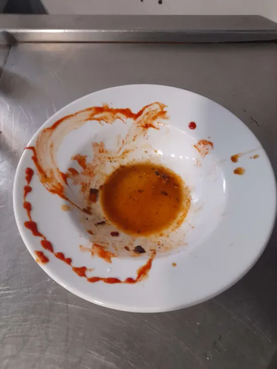

Hello friend,

Hello friend, you have been created in my head as a way for me to combat loneliness in this world. You would be surprise with how many people you can know and still feel lonely at night, some nights are unbearable, I just can't keep it all within, I try to drown it with music but now it just makes things worst, I got used to sleeping with it. I am getting support from a good old friend from my college, we go way back. But it hurts when a **Best Friend** / **Soul Brother** / **Family** turns on you from the front. You get to see there faceless expression as a way of saying I don't understand you so **die**, it hurts, I wouldn't wish that on anyone. 

I also don't want to see her go and leave the house with someone that do bad things, I will end up doing something stupid. It hurts writing this. My plushy that was given by her helps at night.

Something strange happened at work yesterday, the morning started with me driving through a storm on the way and seeing a friend that I met first shift walking up so I give a thumbs up ヽ(゜～゜o)ノ

I arrive 15 minutes early and everyone says hi to me, I smile back and say hello. In the staff room eating the pineapple my aunt gave me for lunch I see that same friend from the storm.

We're both Asian so we share and celebrate a lot of our culture and differences, talk about past difficulties and support each other like brothers. We try to understand each other.

Walking with storm friend we meet with his brother which also works there, we catch up, laugh, play around like boys while waiting for the day to start, which is when I first see her.

**Storm**'s brother says in a joking way shes a manager so we can mess around so she would take the blame, **bruh** ╥﹏╥.
She looked young, maybe around my age, I play along Storm and his brother more and start the day at the machine.

The machine is scary, it's large, eats things and can hurt what it eats if not careful. There is a **Elder Rat** who works inside the machine room with me inside this castle. Some say he came with the place from the 1800s but they're just trolling.

The Elder Rat knows the ins and out of the castle catacomb and knows the machine room more than any, everyone looks down on him for being slow moving but I see something different. I saw him clean the machine with ease, he did an amazing job at it with ease like casting a spell to get it to clean itself, compared to me seeing others who don't understand the machine, they did a poor, long job lol.

After a gruesome first half of the day in the machine it's finlay time to eat, I haven't eaten all day and could pounce at a prey if my life depended on it, hunger makes me a bit angry, focused, clear minded, on edge. 

Today's lunch is amazing, truly magical, minced beef with green and red bell peppers, egg plants, mushrooms, a delicious sauce and asparagus ♡٩(^▿^)۶♡ 

Before eating I try to look for **Storm** and the boys but can't seem to find them, so I serve myself a plate and follow the Elder Rat to a table.

There are multiple girls on the table so I sit in-between two empty seats, I see her come last with her plate slowly and sits next to me. It's the "Manager" from the start of the day, she wore all black, her hair, her eyes, her shirt, apron, trousers, shoes everything. I am nervous, what is this feeling? She is like an All black house sparrow.

She's the one to start the conversation and break the pressure that was building, picking up from an older conversation with another girl she started with how growing asparagus is an amazing form of making a living, it's peaceful as you only have to work like 3 months a year as it's a great to make a living. I said that was "cool", I sounded stupid. 

She has hair clipped up like a palm tree, She has freckles, She wears black eye liner, She has sever OCD, She has a big family abroad, many sister where the youngest is just a couple months young, She studies a neural science course at university and is interested the effects drug has on the brain, She can't get the medication she needs, She is thinking of moving down here in the little town, I said I like anime and she said it back, she moved slightly closer with her crossed legs but I don't know what to do, everyone was saying to her to move to a city but I said our town is beautiful with sun and ocean and we work at a castle which made her giggle, that laugh of hers keeps replaying in my head, there was talk about drugs it was too much for me, I need support I need to get out of here, I feel like running, I finished my food I need to run.

Storm comes and join, I am relieved, he brings back the sun when the fog started to block my view. I smile, I laugh, I love.

Break is over and I need some sun, I take my glasses off and bath in the sun through the religious glass panes like a plant recharging and nurturing. I am calm like still water.

She is still sitting at the table, oh no, did I do something stupid, did she see me being weird, she thinks I'm weird, will she pretend to like me but out of empathy?

I put my glasses back and walk slowly back, I can't help but look at her focused on some papers straight after break. She is hard working, maybe for her family, she struggles with a lot of things like me. I try to understand.

I forget my plate and soon see it in the machine room for it to be eaten, I don't want it do end, I don't want it to die, I don't want to forget but I let go and take a picture to remember, the plate that I played with during the heavy conversations helped me distract myself for a short period. It looked like a painting.

On the drive back I screamed, what is this feeling, my chest hurts, I can't think, I don't want to die I want to live.

https://open.spotify.com/track/5awii6NgEPbGSQSCiyErCp?si=5b9c78aa54654a71

**Disclaimer** *: This blog post is a work of fiction. Names, characters, businesses, places, events, and incidents are either the products of the author's imagination or used in a fictitious manner. Any resemblance to actual persons, living or dead, or actual events is purely coincidental.*