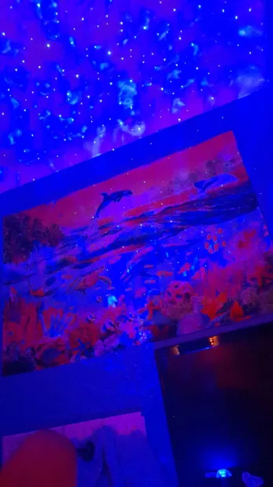

At home, W.Rabbit was about to fall asleep enjoying the blue spaceship he got as a gift from B.Rabbit while reading Berserk on his laptop with the window open to let in cool breezes.

This was during the time his sister the "Grey and Black bunny" had her boyfriend over but didn't say when, W.Rabbit knew that since during the gym he was informed by a hawk that she was seen with a 30 year old, scarred Lion which he initially didn't know who it was but during a set it clicked.

Chilling in his room with the galaxy lights on, LED in sync with music while reading Berserk on his laptop, this was when he heard it. A loud stumping sound on the balcony roof part of the second floor, he felt a stabbing sensation in his chest which activated a fight or flight mode in his brain. He quickly switched off all the lights, his laptop, grab his gun and butterfly knife listening in the darkness.

He then turned all the lights back on and went into alarm mode telling everyone that he sees a fox knocking on all the doors, his aunt was concerned. He really felt like his sister's boyfriend has come to stab him for some reason but he felt in the back of his mind this wasn't right as to why someone would sneak through a window just to stab him, it was probably some cat that has jumped down.

He turned on some music to calm himself down which worked but still had to check around GB.Rabbit's room. He grabs his gun and flashlight and proceeds to do a breach and clear in the room but founds nothing.

His Aunt was worried and wouldn't stop bothering him when trying to sleep so he decided to stay up and do all sorts of waky shit off the Penjamin like putting on his Quest VR 2 healmet on with passthrough vision using them as night vision goggles and howling at the moon with them. Making religious symbolic hand gestures to fight off demons. Taking off all of his clothes.