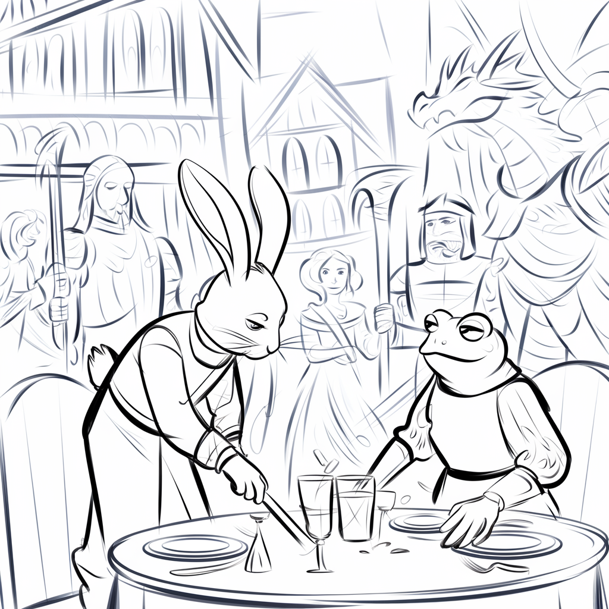
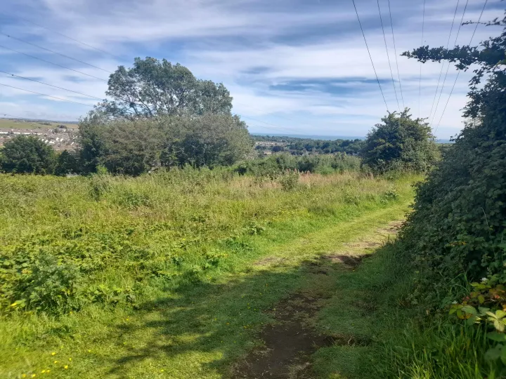
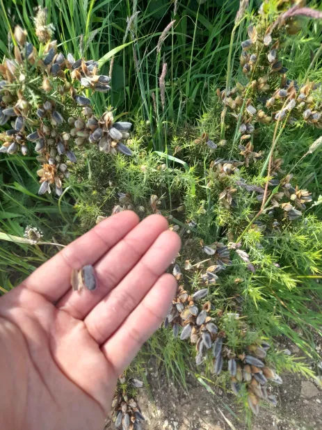
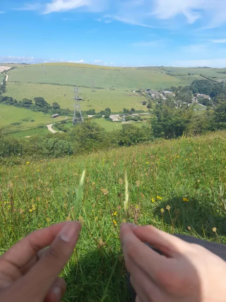
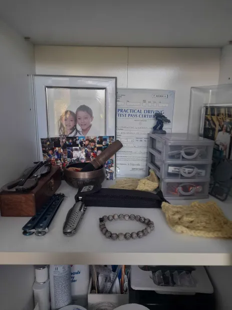

<iframe style="border-radius:12px" src="https://open.spotify.com/embed/track/1DOAgTa0nwBi3zyhrvcE0T?utm_source=generator" width="100%" height="352" frameBorder="0" allowfullscreen="" allow="autoplay; clipboard-write; encrypted-media; fullscreen; picture-in-picture" loading="lazy"></iframe>

On the drive back work the White Rabbit saw fellow rabbits on the way like he always does which gave him the idea to feed them carrots on a next visit. The drive up to work was a calm and relaxing one as there was lots of river banks and wild animals along an airport which the White Rabbit would get excited when an airplane would come for a landing.

Arriving to work the Rabbit see Storm and another girl talking so he goes over as the conversation which seems more interesting than other workers and it was, they seemed to be really into talking about anything and the flow of the conversation was fluid which allowed me to join in, it was like talking in a VR chat lobby where people would just talk about anything and everything which made work enjoyable.

Then a cute autistic Frog appeared and joined in the conversation, she was petite and pale skinned with brunet hair. She wasn't his type at the time so he didn't think much of her and engage in a conversation within social flow. It really felt natural to the Rabbit which was the first in a long time that he has talked to a Frog which didn't seem much of a challenge to him.

The day goes by with the Rabbit and the Frog crossing paths and exchanging words and funny jokes in a flirtatious way, the Rabbit was a completely natural at talking putting the blame on the Frog because he spilled some plant water and learning that she has been at this college before.

After the long day of working the Rabbit and Storm grouped up at the end of the day, they share wise ass wisdom shi which should be engraved somewhere in the world, the Frog and the other girl approaches them for one last goodbye. The Rabbit was showing storm and handshake he'd learned from someone else where you would click each others thumb and index finger which he then tried with the Frog which sparked something in his brain. "Hey I really like this girl."

After the encounter he decided to ask that girls instagram or snapchat however I was told to leave early by one of the managers but I stayed longer.

On the drive back the White Rabbit decided to go to his good pal Black Rabbit's house to check up on him, 

"It has been such a long time bruv." the Black Rabbit says. 

"Yeah it has wanted to check up on you and everything." The White rabbit said with nervousness.

"Come in I have a little present for you it's a spaceship." The Black Rabbit offered to come.

The Black Rabbit is well known for is trickery spells and dangerous candies around the neighbehood. W.Rabbit got drunk here for the first time and passed out which meant he had to be hospitalized. W.Rabbit goes inside B.Rabbit's room and sees a pill of candies.

B.Rabbit hands over a small device which had a tube like shape small enough to hold, it had a small vessel to hold liquids. It was blue and had a cookie bite mark on the tip where you were supposed to put your mouth and inhale, this was a special spaceship as it had an option to switch between two flavours.

After hitting it, W.Rabbit and B.Rabbit decides to go out for a walk outside for a nice walk out with the spaceship in pocket. They pack everything they need and set off without anything forgotten. They were best buds since childhood and love talking shit down the mic which angers everyone on the other side.

They go out on adventures:

After the day out they return and W.Rabbit then returns home and then end the day with a prayer to the shrine.

Conclusion:

<iframe style="border-radius:12px" src="https://open.spotify.com/embed/track/0sTjyzgd2K5htQpU8ienNe?utm_source=generator" width="100%" height="352" frameBorder="0" allowfullscreen="" allow="autoplay; clipboard-write; encrypted-media; fullscreen; picture-in-picture" loading="lazy"></iframe>
This ones a short one, thank you for reading I really appreaciate who you might be. My writing has improved so much and I feel life has become much bigger than it was in december when depression kicks in and you're inside all the time, Now I'm looking forward to it since there will be girls and lots to do. Just had my first date today (20/09/24). It was great and an amazing feeling to be alive for, love is in the air.

If you play the songs I put out this will enhance your experience with the reading, I hand pick these to match the vibe of the post so stay tune to my instagram.

This ones a short one but make sure to follow me on all social as I mostly active on Snapchat n Instagram so I would love to hear what you would like to be written about on the story. I leave you guys to it then thanks for tunning in to this intergalactic blog from this corner of the internet <33 ❤️

content/posts/Yap-series/Spaceship/Girl-koala.jpg